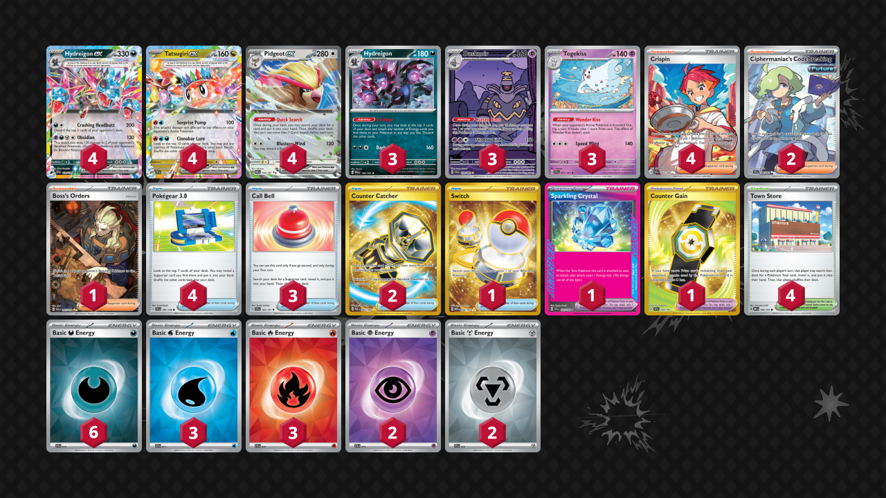

# Tatsugiri/Hydreigon

Tier **F** | Difficulty: **Easy** | Gameplan: **Combo Accumulate**

**Source**: Snipe The Bench - [YouTube video](https://www.youtube.com/watch?v=hrsj256nI40)

## List
* 4 Hydreigon ex SSP 119
* 4 Tatsugiri ex SSP 142
* 4 Pidgeot ex OBF 164
* 3 Hydreigon PAL 140
* 3 Dusknoir SFA 70
* 3 Togekiss SSP 72
* 1 Boss's Orders PAL 265
* 3 Call Bell SSP 165
* 2 Ciphermaniac's Codebreaking TEF 198
* 4 Crispin SCR 164
* 4 Town Store OBF 196
* 4 Pokégear 3.0 SVI 186
* 1 Sparkling Crystal SCR 142
* 2 Counter Catcher PAR 264
* 1 Counter Gain SSP 249
* 1 Switch MEW 206
* 3 Basic {W} Energy SVE 11
* 6 Basic {D} Energy SVE 15
* 3 Basic {R} Energy SVE 10
* 2 Basic {P} Energy SVE 13
* 2 Basic {M} Energy SVE 16