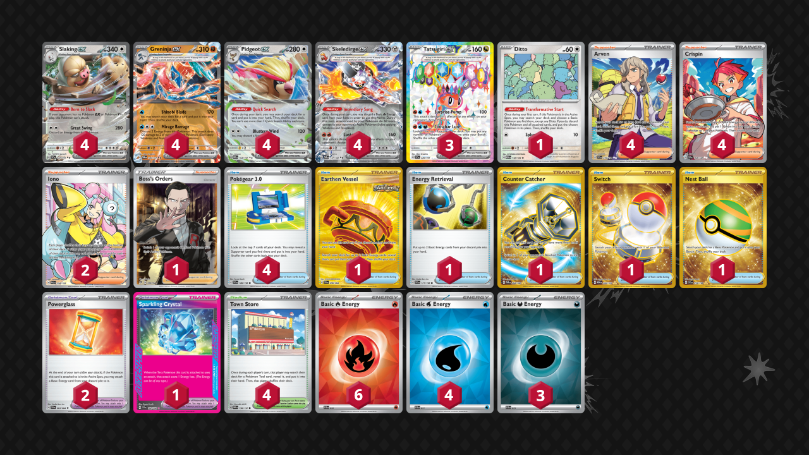

# Tatsugiri/Slaking

Tier **5** | Difficulty: **Easy** | Gameplan: **Combo Midrange**

**Source**: OmniPoke - [YouTube video](https://www.youtube.com/watch?v=GPDA7WylPyo)

## List
* 3 Tatsugiri ex SSP 226
* 4 Slaking ex SSP 147
* 4 Greninja ex TWM 106
* 4 Pidgeot ex OBF 164
* 1 Ditto MEW 132
* 4 Skeledirge ex PAR 137
* 2 Powerglass SFA 63
* 4 Arven SVI 235
* 1 Earthen Vessel SFA 96
* 1 Energy Retrieval SVI 171
* 4 Crispin SCR 164
* 4 Town Store OBF 196
* 4 Pokégear 3.0 SVI 186
* 1 Sparkling Crystal SCR 142
* 2 Iono PAL 254
* 1 Counter Catcher PAR 264
* 1 Boss's Orders RCL 189
* 1 Switch MEW 206
* 1 Nest Ball SVI 255
* 4 Basic {W} Energy SVE 11
* 3 Basic {D} Energy SVE 15
* 6 Basic {R} Energy SVE 10