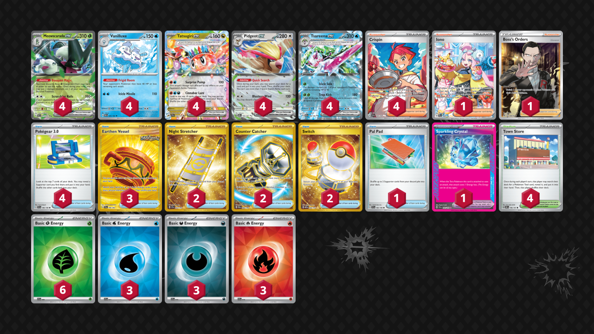

# Tatsugiri/Vanilluxe

Tier **5** | Difficulty: **Easy** | Gameplan: **Combo Disruption**

**Source**: PokecaBook - [Gym Battle Winner](https://www.pokemon-card.com/deck/result.html/deckID/FkkkVk-7CRCQv-V5FwVV/)

## List
* 4 Meowscarada ex PAL 15
* 4 Vanilluxe PAR 45
* 4 Tatsugiri ex SSP 142
* 4 Pidgeot ex OBF 164
* 4 Tsareena ex PAR 46
* 3 Earthen Vessel SFA 96
* 1 Iono PAL 269
* 2 Night Stretcher SSP 251
* 4 Crispin SCR 164
* 4 Town Store OBF 196
* 4 Pokégear 3.0 SVI 186
* 1 Pal Pad SVI 182
* 1 Sparkling Crystal SCR 142
* 2 Counter Catcher PAR 264
* 1 Boss's Orders RCL 189
* 2 Switch MEW 206
* 3 Basic {W} Energy SVE 11
* 3 Basic {D} Energy SVE 15
* 3 Basic {R} Energy SVE 10
* 6 Basic {G} Energy SVE 9