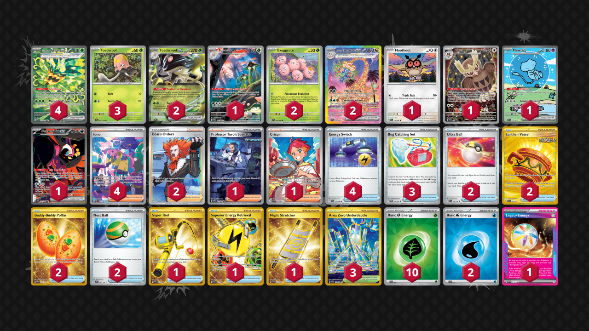

# Toedscruel/Ogerpon

Tier **3** | Difficulty: **Moderate** | Gameplan: **Midrange**

**Source**: Brandon Light - [Day 2 Regional Sacramento, CA](https://limitlesstcg.com/decks/list/14362)

## List
* 3 Toedscool SCR 17
* 4 Teal Mask Ogerpon ex TWM 211
* 1 Mew ex PAF 232
* 2 Toedscruel ex OBF 22
* 1 Hoothoot SCR 114
* 1 Fezandipiti ex SFA 92
* 2 Exeggcute SSP 1
* 1 Noctowl PR-SV 141
* 2 Alolan Exeggutor ex SSP 242
* 1 Toedscruel PAR 185
* 2 Ultra Ball SVI 196
* 2 Earthen Vessel SFA 96
* 4 Energy Switch SVI 173
* 1 Super Rod PAL 276
* 4 Iono PAF 237
* 1 Superior Energy Retrieval PAL 277
* 1 Night Stretcher SSP 251
* 1 Professor Turo's Scenario PAR 257
* 2 Boss's Orders LOR-TG 24
* 1 Crispin SCR 164
* 2 Buddy-Buddy Poffin TWM 223
* 2 Nest Ball SVI 181
* 3 Area Zero Underdepths SCR 174
* 3 Bug Catching Set TWM 143
* 2 Basic {W} Energy SVE 11
* 10 Basic {G} Energy SVE 9
* 1 Legacy Energy TWM 167