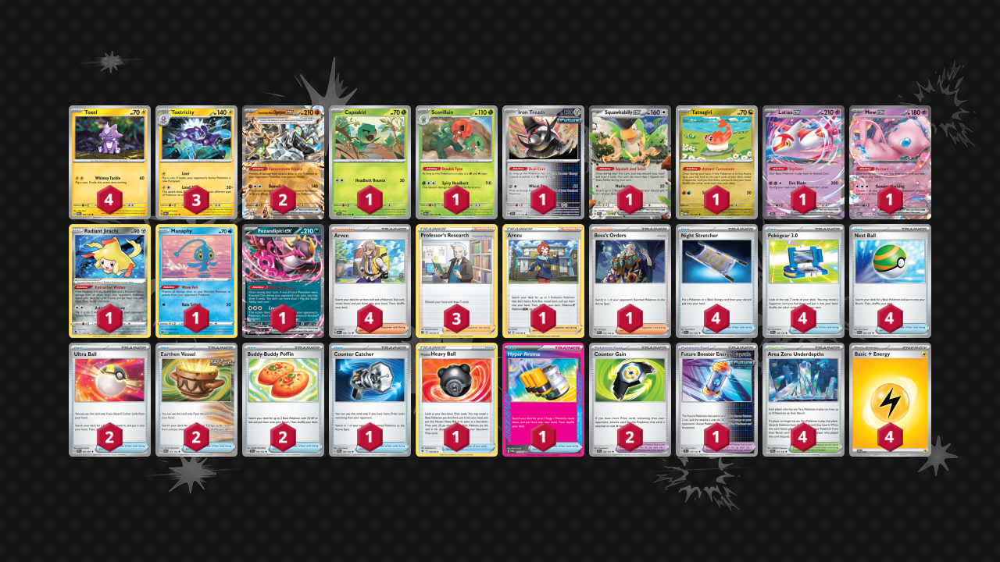

# Loud Mix Toxtricity

Tier **F** | Difficulty: **Moderate** | Gameplan: **Midrange**

**Source**: Sivta Tres

## List
* 1 Capsakid SSP 12
* 1 Iron Treads TEF 118
* 1 Squawkabilly ex PAF 75
* 1 Tatsugiri TWM 131
* 1 Latias ex SSP 76
* 1 Mew ex MEW 151
* 3 Toxtricity OBF 72
* 1 Radiant Jirachi SIT 120
* 1 Manaphy BRS 41
* 1 Fezandipiti ex SFA 38
* 1 Scovillain OBF 25
* 4 Toxel PAR 69
* 2 Cornerstone Mask Ogerpon ex TWM 112
* 3 Professor's Research BRS 147
* 2 Ultra Ball PAF 91
* 2 Counter Gain SSP 169
* 4 Arven OBF 186
* 2 Earthen Vessel PAR 163
* 4 Area Zero Underdepths SCR 131
* 2 Buddy-Buddy Poffin TEF 144
* 1 Counter Catcher PAR 160
* 1 Hisuian Heavy Ball ASR 146
* 1 Future Booster Energy Capsule TEF 149
* 1 Hyper Aroma TWM 152
* 4 Night Stretcher SFA 61
* 4 Pokégear 3.0 SVI 186
* 1 Arezu LOR 153
* 4 Nest Ball PAF 84
* 1 Boss's Orders PAL 172
* 4 Basic {L} Energy SVE 4