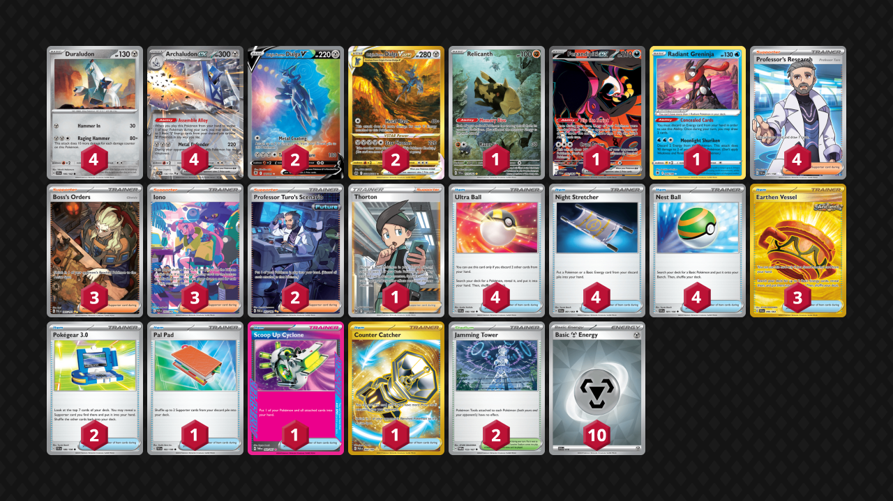
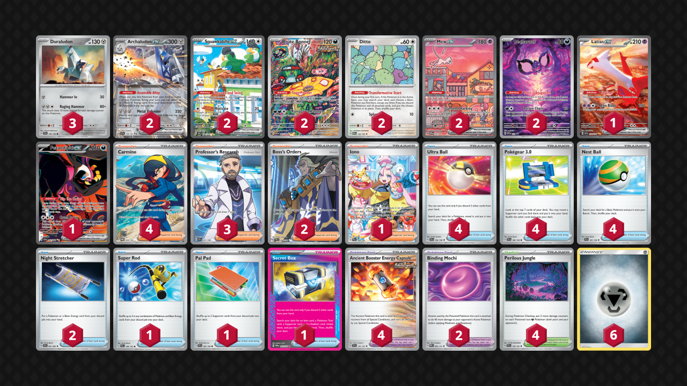

# Archaludon ex

* [Dialga VSTAR](#dialga-vstar)
* [Poison](#poison)

## Dialga VSTAR

Tier **2** | Difficulty: **Moderate** | Gameplan: **Midrange**

**Source**: Yota Wakai - [1st Place Champions League Osaka](https://limitlesstcg.com/decks/list/15057)

[top](#archaludon-ex)

## List
* 2 Origin Forme Dialga V ASR 177
* 1 Relicanth TEF 173
* 4 Duraludon SCR 106
* 2 Origin Forme Dialga VSTAR CRZ-GG 68
* 1 Fezandipiti ex SFA 92
* 1 Radiant Greninja ASR 46
* 4 Archaludon ex SSP 130
* 4 Ultra Ball SVI 196
* 3 Earthen Vessel SFA 96
* 3 Boss's Orders PAL 265
* 3 Iono PAF 237
* 2 Jamming Tower TWM 153
* 2 Professor Turo's Scenario PAR 257
* 4 Night Stretcher SFA 61
* 1 Thorton LOR 195
* 2 Pokégear 3.0 SVI 186
* 4 Professor's Research SVI 241
* 1 Pal Pad SVI 182
* 4 Nest Ball SVI 181
* 1 Scoop Up Cyclone TWM 162
* 1 Counter Catcher PAR 264
* 10 Basic {M} Energy SVE 16

## Poison

Tier **5** | Difficulty: **Moderate** | Gameplan: **Midrange Donk**

**Source**: セレニウム - [1st Place City League Ōsaka 03/09](https://limitlesstcg.com/decks/list/jp/32938)

[top](#archaludon-ex)

## List
* 2 Squawkabilly ex PAL 264
* 3 Duraludon SCR 106
* 1 Latias ex SSP 239
* 2 Brute Bonnet PAR 207
* 1 Fezandipiti ex SFA 92
* 2 Ditto MEW 132
* 2 Mew ex PR-SV 53
* 2 Pecharunt PR-SV 129
* 2 Archaludon ex SSP 130
* 4 Ultra Ball SVI 196
* 4 Ancient Booster Energy Capsule TEF 140
* 1 Iono PAL 269
* 2 Boss's Orders PAL 248
* 2 Binding Mochi PRE 95
* 2 Night Stretcher SFA 61
* 1 Super Rod PAL 188
* 4 Pokégear 3.0 SVI 186
* 3 Professor's Research SVI 241
* 4 Perilous Jungle TEF 156
* 1 Pal Pad SVI 182
* 4 Nest Ball SVI 181
* 1 Secret Box TWM 163
* 4 Carmine TWM 204
* 6 Basic {M} Energy Energy 8
