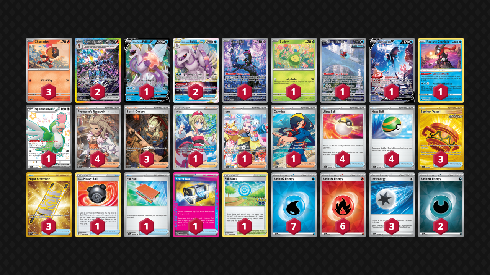

# Ceruledge ex

* [Palkia VSTAR](#palkia-vstar)
* [Iron Hands ex](#iron-hands-ex)

## Palkia VSTAR

Tier **3** | Difficulty: **Moderate** | Gameplan: **Turbo Midrange**

**Source**: Takashi Yoneda - [Top 8 Champions League Osaka](https://limitlesstcg.com/decks/list/15068)

[top](#ceruledge-ex)

## List
* 1 Munkidori SFA 72
* 1 Budew PRE 4
* 1 Iron Bundle PR-SV 66
* 2 Ceruledge ex PRE 147
* 1 Lumineon V BRS 156
* 1 Origin Forme Palkia V ASR 39
* 2 Origin Forme Palkia VSTAR ASR 40
* 1 Radiant Greninja ASR 46
* 1 Squawkabilly ex PAF 223
* 3 Charcadet SSP 32
* 4 Ultra Ball SVI 196
* 1 Irida ASR 186
* 3 Earthen Vessel SFA 96
* 3 Boss's Orders PAL 265
* 1 Hisuian Heavy Ball ASR 146
* 1 Iono PAL 269
* 3 Night Stretcher SSP 251
* 1 PokéStop PGO 68
* 4 Professor's Research SVI 240
* 1 Pal Pad SVI 182
* 4 Nest Ball SVI 181
* 1 Secret Box TWM 163
* 1 Carmine TWM 204
* 7 Basic {W} Energy SVE 11
* 2 Basic {D} Energy SVE 15
* 6 Basic {R} Energy SVE 10
* 3 Jet Energy PAL 190

## Iron Hands ex

Tier **5** | Difficulty: **Moderate** | Gameplan: **Turbo Midrange**

**Source**: Sanghyun Noh - [Top 16 Korean League Season 3](https://limitlesstcg.com/decks/list/15949)

[top](#ceruledge-ex)

## List
* 1 Squawkabilly ex PAL 264
* 1 Latias ex SSP 239
* 3 Ceruledge ex PRE 147
* 1 Fezandipiti ex SFA 38
* 1 Radiant Greninja ASR 46
* 2 Iron Hands ex PAR 248
* 3 Charcadet SSP 32
* 3 Ultra Ball SVI 196
* 2 Academy at Night SFA 54
* 3 Boss's Orders PAL 265
* 4 Electric Generator SVI 170
* 1 Brilliant Blender SSP 164
* 3 Night Stretcher SSP 251
* 1 Professor Turo's Scenario PAR 257
* 3 Professor's Research SVI 241
* 1 Pal Pad SVI 182
* 4 Nest Ball SVI 181
* 4 Carmine TWM 204
* 14 Basic {L} Energy SVE 4
* 3 Basic {R} Energy SVE 10
* 2 Jet Energy PAL 190
