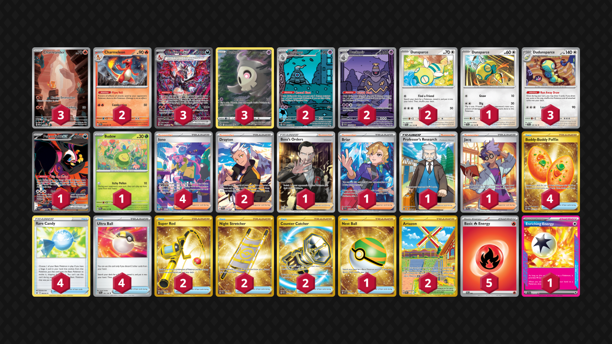

# Charizard/Dudunsparce

Tier **5** | Difficulty: **Hard** | Gameplan: **Turbo Accumulate**

**Source**: Zach Lesage - [Twitter post](https://x.com/ZachLesagePTCG/status/1888399244827988321)

## List
* 1 Dunsparce TEF 128
* 3 Dudunsparce TEF 129
* 1 Fezandipiti ex SFA 92
* 2 Charmeleon PAF 8
* 3 Charmander MEW 168
* 2 Dunsparce PAL 156
* 1 Budew PRE 4 PH
* 3 Charizard ex PAF 234
* 3 Duskull CRZ-GG 28
* 2 Dusclops SFA 69
* 2 Dusknoir SFA 70
* 2 Drayton SSP 232
* 1 Boss's Orders RCL 189
* 4 Buddy-Buddy Poffin TWM 223
* 1 Briar SCR 163
* 4 Rare Candy SSH 180
* 2 Super Rod PAL 276
* 2 Artazon OBF 229
* 1 Professor's Research CRZ 150
* 1 Nest Ball SVI 255
* 4 Iono PAF 237
* 2 Night Stretcher SSP 251
* 1 Jacq SVI 236
* 2 Counter Catcher PAR 264
* 4 Ultra Ball SVI 196
* 5 Basic {R} Energy SVE 2
* 1 Enriching Energy SSP 191