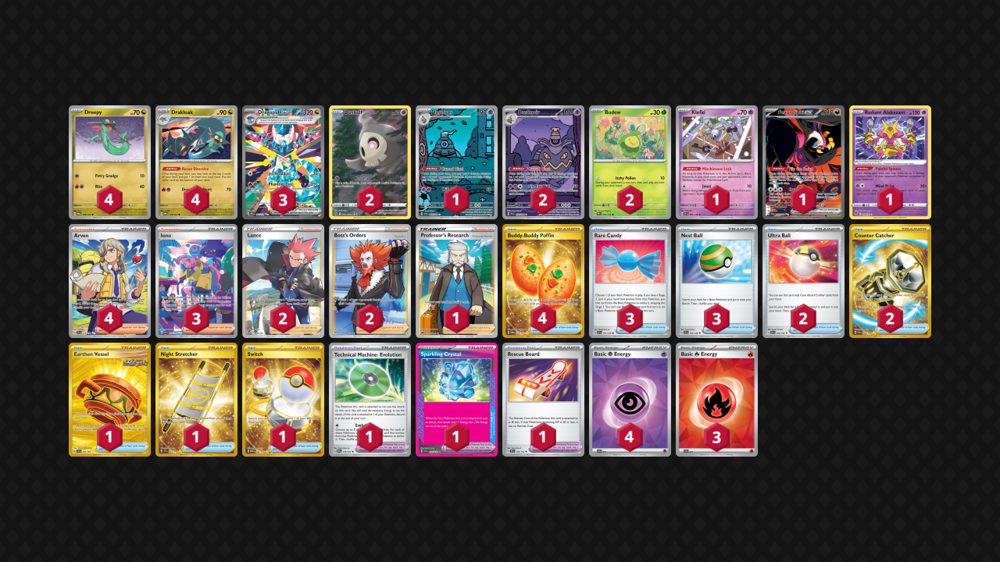
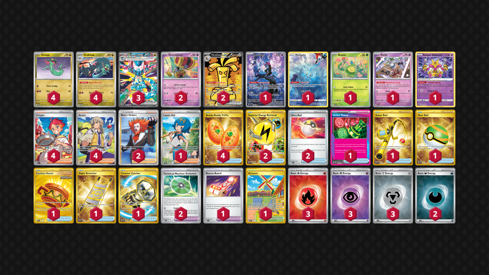

# Dragapult ex

* [Cursed Blast Dusknoir](#cursed-blast-dusknoir)
* [Gholdengo ex](#gholdengo-ex)
* [Iron Thorns ex](#iron-thorns-ex)

## Cursed Blast Dusknoir

Tier **1** | Difficulty: **Hard** | Gameplan: **Accumulate Spread**

**Source**: Ryunosuke Murata - [Top 4 Champions League Osaka](https://limitlesstcg.com/decks/list/15059)

[top](#dragapult-ex)

## List
* 1 Klefki SVI 96
* 3 Dragapult ex PRE 165
* 4 Drakloak TWM 129
* 4 Dreepy TWM 128
* 1 Dusclops SFA 69
* 2 Duskull CRZ-GG 28
* 1 Fezandipiti ex SFA 92
* 1 Radiant Alakazam SIT 59
* 2 Budew PRE 4
* 2 Dusknoir SFA 70
* 2 Ultra Ball SVI 196
* 2 Lance SIT 192
* 4 Arven SVI 235
* 1 Earthen Vessel SFA 96
* 3 Rare Candy SVI 191
* 3 Iono PAF 237
* 1 Night Stretcher SSP 251
* 2 Boss's Orders LOR-TG 24
* 1 Technical Machine: Evolution PAR 178
* 1 Professor's Research CRZ 150
* 4 Buddy-Buddy Poffin TWM 223
* 1 Sparkling Crystal SCR 142
* 3 Nest Ball SVI 181
* 1 Rescue Board TEF 159
* 2 Counter Catcher PAR 264
* 1 Switch MEW 206
* 3 Basic {R} Energy SVE 10
* 4 Basic {P} Energy SVE 13

## Gholdengo ex

Tier **3** | Difficulty: **Hard** | Gameplan: **Accumulate Midrange**

**Source**: Kazuki Inoue - [Top 16 Champions League Osaka](https://limitlesstcg.com/decks/list/15064)

[top](#dragapult-ex)

## List
* 1 Munkidori SFA 72
* 3 Dragapult ex PRE 165
* 2 Gholdengo ex PAR 252
* 4 Drakloak TWM 129
* 1 Manaphy CRZ-GG 6
* 4 Dreepy TWM 128
* 1 Budew PRE 4
* 2 Gimmighoul PAR 87
* 1 Klefki SVI 96
* 1 Radiant Alakazam SIT 59
* 1 Lana's Aid TWM 207
* 4 Buddy-Buddy Poffin TWM 223
* 4 Crispin SCR 164
* 1 Unfair Stamp TWM 165
* 1 Super Rod PAL 276
* 2 Superior Energy Retrieval PAL 277
* 1 Artazon OBF 229
* 2 Boss's Orders LOR-TG 24
* 1 Nest Ball SVI 255
* 1 Earthen Vessel SFA 96
* 1 Rescue Board TEF 159
* 1 Night Stretcher SSP 251
* 2 Technical Machine: Evolution PAR 178
* 4 Arven SVI 235
* 1 Counter Catcher PAR 264
* 2 Ultra Ball SVI 196
* 3 Basic {R} Energy SVE 10
* 2 Basic {D} Energy SVE 15
* 3 Basic {P} Energy SVE 13
* 3 Basic {M} Energy SVE 16

## Iron Thorns ex

Tier **3** | Difficulty: **Hard** | Gameplan: **Accumulate Disruption**

**Source**: Stefano Da Silva Fontinha Coelho - [Top 64 EUIC 2025, London](https://limitlesstcg.com/decks/list/16047)

[top](#dragapult-ex)

## List
* 1 Klefki SVI 96
* 3 Dragapult ex PRE 165
* 4 Drakloak TWM 129
* 4 Dreepy TWM 128
* 2 Munkidori SFA 72
* 1 Radiant Alakazam SIT 59
* 4 Iron Thorns ex TWM 77
* 2 Ultra Ball SVI 196
* 3 Lance SIT 192
* 4 Arven SVI 235
* 1 Earthen Vessel SFA 96
* 1 Counter Catcher PAR 160
* 1 Future Booster Energy Capsule TEF 149
* 1 Iono PAL 269
* 1 Night Stretcher SSP 251
* 1 Professor Turo's Scenario PAR 257
* 2 Boss's Orders PAL 248
* 2 Technical Machine: Evolution PAR 178
* 4 Crispin SCR 164
* 1 Lost Vacuum LOR 217
* 4 Pokégear 3.0 SVI 186
* 1 Buddy-Buddy Poffin TWM 223
* 1 Rescue Board TEF 159
* 1 Precious Trolley SSP 185
* 2 Basic {L} Energy SVE 12
* 2 Basic {D} Energy SVE 15
* 3 Basic {R} Energy SVE 10
* 3 Basic {P} Energy SVE 13
