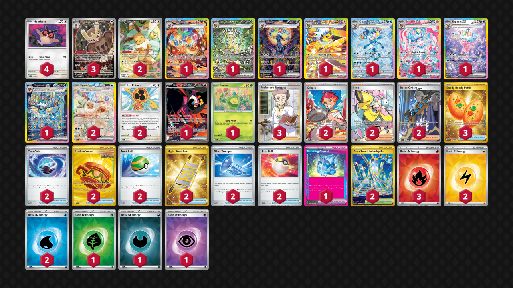

# Eeveelutions

Tier **F** | Difficulty: **Moderate** | Gameplan: **Toolbox**

**Source**: Sivta Tres

## List
* 1 Flareon ex PRE 146
* 1 Leafeon ex PRE 144
* 4 Hoothoot TEF 126
* 1 Umbreon ex PRE 161
* 1 Fezandipiti ex SFA 92
* 2 Eevee ex PRE 167
* 3 Noctowl PR-SV 141
* 1 Jolteon ex PRE 153
* 1 Glaceon ex PRE 150
* 1 Sylveon ex PRE 156
* 1 Budew PRE 4
* 1 Espeon ex PRE 155
* 2 Eevee PR-SV 173
* 2 Fan Rotom PRE 85
* 1 Vaporeon ex PRE 149
* 3 Buddy-Buddy Poffin TWM 223
* 2 Crispin SCR 164
* 2 Iono PAL 254
* 2 Tera Orb SSP 189
* 2 Earthen Vessel SFA 96
* 2 Nest Ball SVI 181
* 3 Professor's Research SSH 201
* 2 Night Stretcher SSP 251
* 2 Boss's Orders PAL 248
* 2 Area Zero Underdepths SCR 174
* 2 Glass Trumpet SCR 135
* 2 Ultra Ball SVI 196
* 1 Sparkling Crystal SCR 142
* 3 Basic {R} Energy SVE 10
* 2 Basic {L} Energy SVE 12
* 1 Basic {G} Energy SVE 9
* 1 Basic {D} Energy SVE 15
* 2 Basic {W} Energy SVE 11
* 1 Basic {P} Energy SVE 13