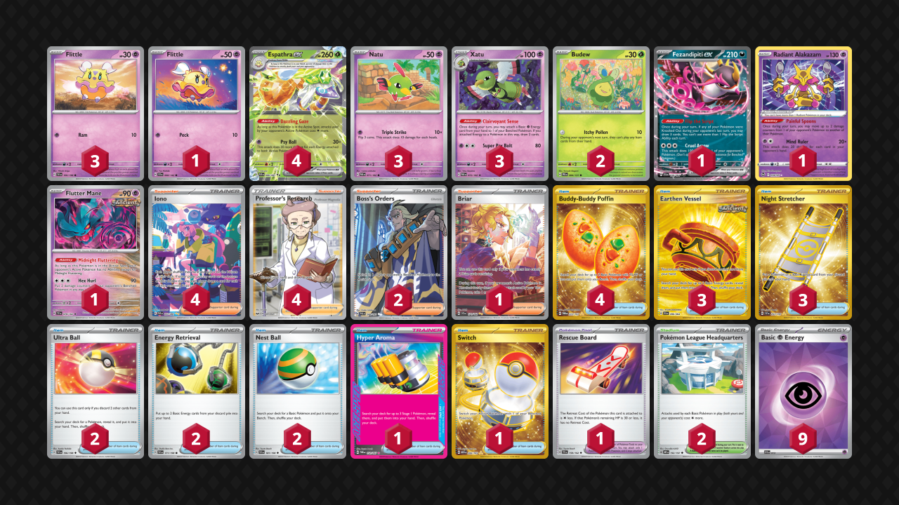

# Espathra/Xatu

Tier **5** | Difficulty: **Moderate** | Gameplan: **Midrange Disruption**

**Source**: WugtrioMil - [2nd Place 🐢Turtle Weekly 11🐢](https://play.limitlesstcg.com/tournament/67900a915229b408d3ce1c24/player/wugtriomil/decklist)

## List
* 3 Xatu PAR 72
* 4 Espathra ex PAF 6
* 1 Fezandipiti ex SFA 38
* 1 Radiant Alakazam SIT 59
* 3 Natu PAR 71
* 2 Budew PRE 4
* 1 Flutter Mane TEF 78
* 3 Flittle SVI 100
* 1 Flittle SCR 68
* 2 Ultra Ball SVI 196
* 3 Earthen Vessel SFA 96
* 2 Energy Retrieval SVI 171
* 4 Iono PAF 237
* 1 Hyper Aroma TWM 152
* 3 Night Stretcher SSP 251
* 2 Boss's Orders PAL 248
* 4 Buddy-Buddy Poffin TWM 223
* 2 Pokémon League Headquarters OBF 192
* 1 Briar SCR 171
* 2 Nest Ball SVI 181
* 1 Rescue Board TEF 159
* 1 Switch MEW 206
* 4 Professor's Research SSH 201
* 9 Basic {P} Energy SVE 13