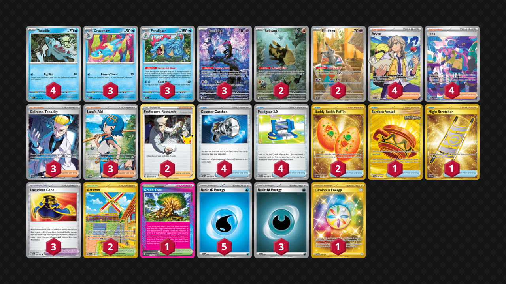

# Feraligatr

Tier **3** | Difficulty: **Hard** | Gameplan: **Control Midrange**

**Source**: む - [1st Place City League Kyōto 01/29](https://limitlesstcg.com/decks/list/jp/28082)

## List
* 4 Totodile TEF 39
* 3 Feraligatr TEF 41
* 2 Relicanth TEF 173
* 3 Munkidori SFA 72
* 3 Croconaw TEF 40
* 2 Mimikyu PR-SV 75
* 4 Arven SVI 235
* 1 Earthen Vessel SFA 96
* 4 Counter Catcher PAR 160
* 3 Luxurious Cape PAR 166
* 1 Grand Tree SCR 136
* 4 Iono PAF 237
* 1 Night Stretcher SSP 251
* 2 Professor's Research CEL 23
* 2 Artazon OBF 229
* 4 Pokégear 3.0 SVI 186
* 2 Buddy-Buddy Poffin TWM 223
* 3 Colress's Tenacity SFA 87
* 3 Lana's Aid TWM 207
* 5 Basic {W} Energy SVE 3
* 3 Basic {D} Energy SVE 7
* 1 Luminous Energy TWM 226