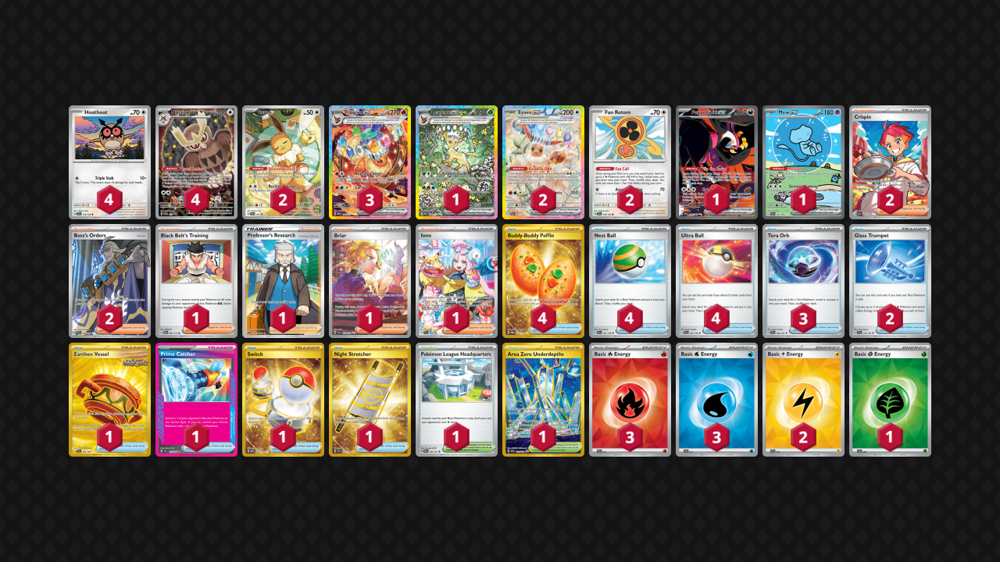
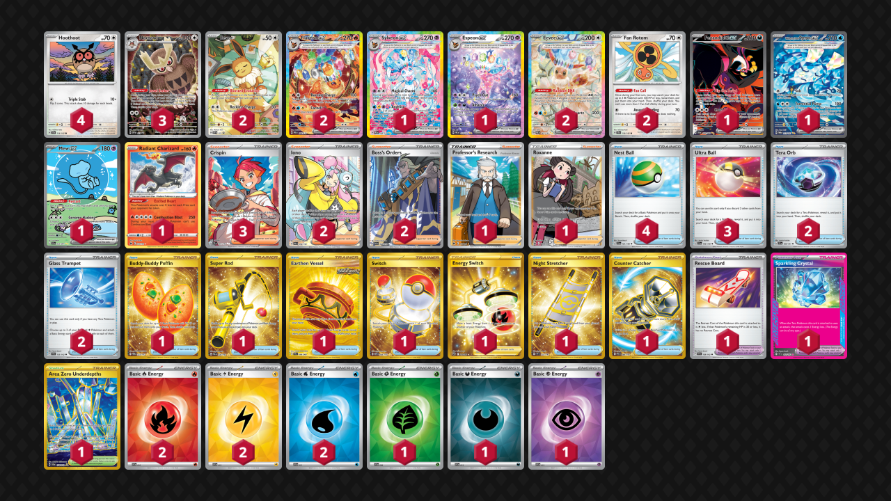

# Flareon ex

* [Leafeon ex](#leafeon-ex)
* [Linear Attack Jolteon](#linear-attack-jolteon)
* [Espeon ex](#espeon ex)

## Leafeon ex

Tier **3** | Difficulty: **Moderate** | Gameplan: **Midrange Tank and Heal**

**Source**: Kansei Ishikawa - [Top 16 Champions League Fukuoka](https://limitlesstcg.com/decks/list/15938)

[top](#flareon-ex)

## List
* 3 Flareon ex PRE 146
* 1 Leafeon ex PRE 144
* 1 Fezandipiti ex SFA 92
* 2 Eevee ex PRE 167
* 4 Noctowl PR-SV 141
* 1 Mew ex PAF 232
* 2 Eevee PR-SV 173
* 4 Hoothoot SCR 114
* 2 Fan Rotom SCR 118
* 4 Buddy-Buddy Poffin TWM 223
* 1 Black Belt's Training PRE 96
* 2 Crispin SCR 164
* 1 Pokémon League Headquarters OBF 192
* 3 Tera Orb SSP 189
* 1 Professor's Research CRZ 150
* 1 Earthen Vessel SFA 96
* 1 Prime Catcher TEF 157
* 4 Nest Ball SVI 181
* 1 Switch MEW 206
* 1 Night Stretcher SSP 251
* 2 Boss's Orders PAL 248
* 1 Briar SCR 171
* 1 Area Zero Underdepths SCR 174
* 1 Iono PAL 269
* 2 Glass Trumpet SCR 135
* 4 Ultra Ball SVI 196
* 3 Basic {R} Energy SVE 10
* 2 Basic {L} Energy SVE 12
* 1 Basic {G} Energy SVE 9
* 3 Basic {W} Energy SVE 11

## Linear Attack Jolteon

Tier **4** | Difficulty: **Moderate** | Gameplan: **Midrange**

**Source**: やっぴ - [1st Place City League Chiba 01/25](https://limitlesstcg.com/decks/list/jp/27438)

[top](#flareon-ex)

## List
* 2 Eevee ex PRE 167
* 1 Mew ex PAF 232
* 1 Hoothoot TEF 126
* 3 Flareon ex PRE 146
* 3 Hoothoot SCR 114
* 1 Fezandipiti ex SFA 92
* 1 Jolteon MEW 135
* 2 Fan Rotom SCR 118
* 2 Eevee PR-SV 173
* 4 Noctowl PR-SV 141
* 4 Ultra Ball SVI 196
* 1 Earthen Vessel SFA 96
* 2 Glass Trumpet SCR 135
* 1 Iono PAL 269
* 1 Night Stretcher SSP 251
* 2 Boss's Orders LOR-TG 24
* 2 Crispin SCR 164
* 4 Buddy-Buddy Poffin TWM 223
* 1 Prime Catcher TEF 157
* 1 Briar SCR 171
* 4 Nest Ball SVI 181
* 2 Area Zero Underdepths SCR 174
* 4 Tera Orb SSP 189
* 1 Black Belt's Training PRE 99
* 1 Switch MEW 206
* 3 Basic {W} Energy SVE 11
* 3 Basic {L} Energy SVE 12
* 3 Basic {R} Energy SVE 10

## Espeon ex

Tier **5** | Difficulty: **Hard** | Gameplan: **Midrange Toolbox**

**Source**: 1saltysteak - [2nd Place Redacted Evolutions #2](https://play.limitlesstcg.com/tournament/678455547960ec710eff52d7/player/1saltysteak/decklist)

[top](#flareon-ex)

## List
* 2 Flareon ex PRE 146
* 1 Fezandipiti ex SFA 92
* 2 Eevee ex PRE 167
* 3 Noctowl PR-SV 141
* 1 Sylveon ex PRE 156
* 1 Wellspring Mask Ogerpon ex TWM 213
* 1 Espeon ex PRE 155
* 1 Mew ex PAF 232
* 2 Eevee PR-SV 173
* 1 Radiant Charizard CRZ 20
* 4 Hoothoot SCR 114
* 2 Fan Rotom SCR 118
* 1 Buddy-Buddy Poffin TWM 223
* 3 Crispin SCR 164
* 2 Iono PAL 254
* 2 Tera Orb SSP 189
* 1 Super Rod PAL 276
* 1 Professor's Research CRZ 150
* 1 Roxanne CRZ-GG 66
* 1 Earthen Vessel SFA 96
* 1 Rescue Board TEF 159
* 4 Nest Ball SVI 181
* 1 Switch MEW 206
* 1 Energy Switch SIT 212
* 1 Night Stretcher SSP 251
* 2 Boss's Orders PAL 248
* 1 Area Zero Underdepths SCR 174
* 1 Counter Catcher PAR 264
* 2 Glass Trumpet SCR 135
* 3 Ultra Ball SVI 196
* 1 Sparkling Crystal SCR 142
* 2 Basic {R} Energy SVE 10
* 2 Basic {L} Energy SVE 12
* 1 Basic {G} Energy SVE 9
* 1 Basic {D} Energy SVE 15
* 2 Basic {W} Energy SVE 11
* 1 Basic {P} Energy SVE 13
