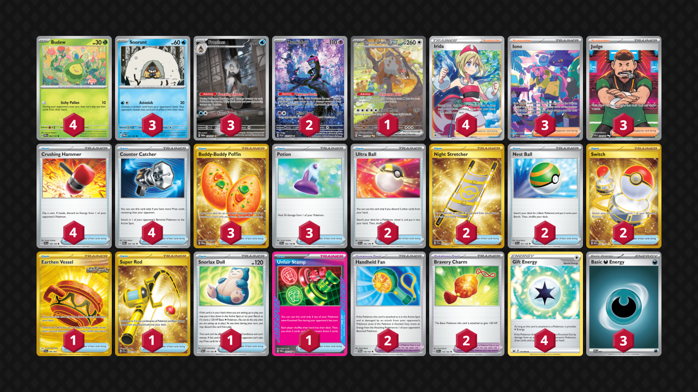

# Froslass/Munkidori

Tier **F** | Difficulty: **Hard** | Gameplan: **Disruption Spread**

**Source**: cruden88 - [Top 16 🏆Moujii's Dojo🏆](https://play.limitlesstcg.com/tournament/6789b370010576265d10fc05/player/cruden88/decklist)

## List
* 1 Bloodmoon Ursaluna ex TWM 216
* 2 Munkidori SFA 72
* 4 Budew PRE 4
* 3 Snorunt TWM 51
* 3 Froslass TWM 174
* 2 Ultra Ball SVI 196
* 4 Irida ASR 186
* 1 Earthen Vessel SFA 96
* 4 Crushing Hammer SVI 168
* 4 Counter Catcher PAR 160
* 1 Super Rod PAL 276
* 3 Iono PAF 237
* 2 Night Stretcher SSP 251
* 1 Snorlax Doll PAR 175
* 3 Buddy-Buddy Poffin TWM 223
* 2 Nest Ball SVI 181
* 1 Unfair Stamp TWM 165
* 3 Potion SVI 188
* 3 Judge PAF 228
* 2 Switch MEW 206
* 2 Handheld Fan TWM 150
* 2 Bravery Charm PAL 173
* 4 Gift Energy LOR 171
* 3 Basic {D} Energy SVE 7