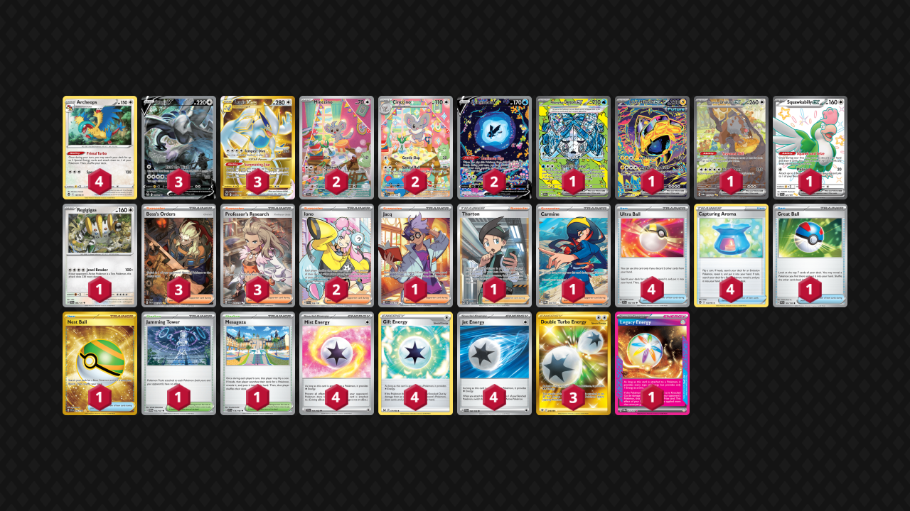

# Lugia/Archeops

Tier **2** | Difficulty: **Moderate** | Gameplan: **Midrange Toolbox**

**Source**: Kiriya Shima - [Top 4 Champions League Osaka](https://limitlesstcg.com/decks/list/15060)

## List
* 1 Wellspring Mask Ogerpon ex PRE 152
* 1 Iron Hands ex PRE 154
* 1 Bloodmoon Ursaluna ex TWM 216
* 4 Archeops SIT 147
* 3 Lugia V SIT 186
* 3 Lugia VSTAR SIT 211
* 2 Minccino TEF 182
* 2 Cinccino TEF 183
* 1 Squawkabilly ex PAF 223
* 1 Regigigas PRE 86
* 2 Lumineon V CRZ-GG 39
* 4 Ultra Ball SVI 196
* 1 Jacq SVI 236
* 3 Boss's Orders PAL 265
* 1 Jamming Tower TWM 153
* 1 Mesagoza SVI 178
* 1 Great Ball PAL 183
* 1 Thorton LOR 195
* 3 Professor's Research SVI 240
* 2 Iono PAL 254
* 4 Capturing Aroma SIT 153
* 1 Carmine TWM 204
* 1 Nest Ball SVI 255
* 4 Mist Energy TEF 161
* 4 Gift Energy LOR 171
* 3 Double Turbo Energy ASR 216
* 1 Legacy Energy TWM 167
* 4 Jet Energy PAL 190