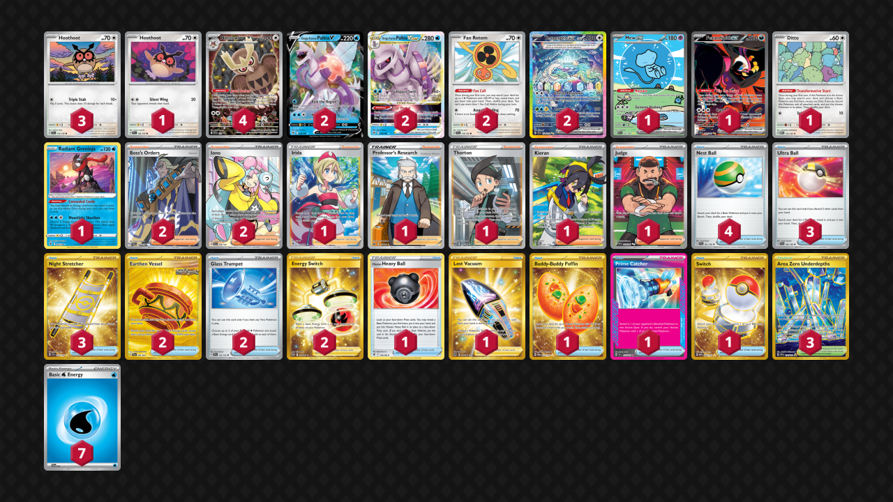

# Palkia/Terapagos

Tier **2** | Difficulty: **Hard** | Gameplan: **Midrange Combo**

**Source**: Supercellcambo - [1st Place Gray's PokéLeague - Prismatic Evolutions Special](https://play.limitlesstcg.com/tournament/673bcbdac4180e08eacfc229/player/supercellcambo/decklist)

## List
* 1 Mew ex PAF 232
* 1 Hoothoot TEF 126
* 2 Origin Forme Palkia V ASR 39
* 3 Hoothoot SCR 114
* 1 Fezandipiti ex SFA 92
* 1 Ditto MEW 132
* 2 Origin Forme Palkia VSTAR ASR 40
* 2 Fan Rotom SCR 118
* 1 Radiant Greninja ASR 46
* 2 Terapagos ex SCR 170
* 4 Noctowl PR-SV 141
* 3 Ultra Ball SVI 196
* 1 Irida ASR 186
* 2 Earthen Vessel SFA 96
* 1 Hisuian Heavy Ball ASR 146
* 2 Glass Trumpet SCR 135
* 3 Night Stretcher SSP 251
* 2 Boss's Orders PAL 248
* 1 Professor's Research CRZ 150
* 2 Energy Switch SIT 212
* 1 Lost Vacuum LOR 217
* 1 Thorton LOR 195
* 1 Buddy-Buddy Poffin TWM 223
* 1 Prime Catcher TEF 157
* 2 Iono PAL 254
* 4 Nest Ball SVI 181
* 3 Area Zero Underdepths SCR 174
* 1 Kieran TWM 206
* 1 Judge PAF 228
* 1 Switch MEW 206
* 7 Basic {W} Energy SVE 3