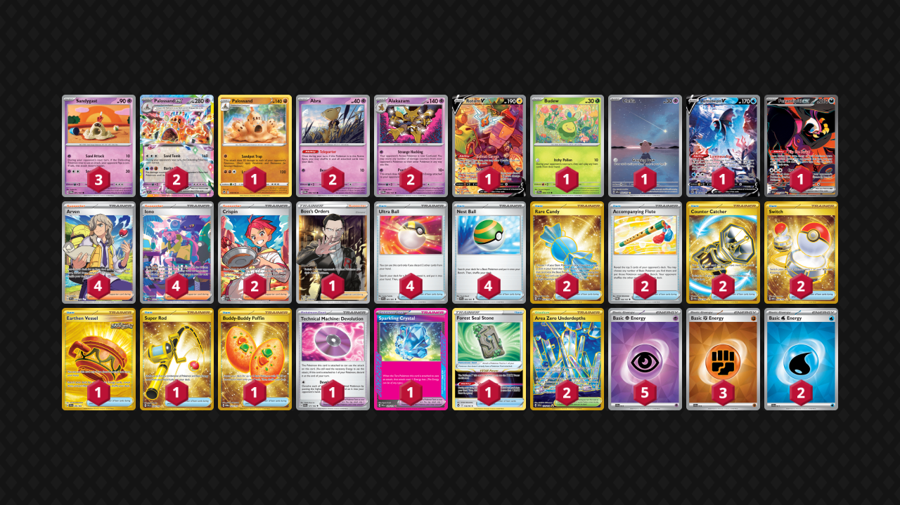

# Palossand/Alakazam

Tier **F** | Difficulty: **Hard** | Gameplan: **Combo Spread**

**Source**: Zach Lesage - [Twitter post](https://ZachLesagePTCG/status/1880306780259119134)

## List
* 1 Rotom V LOR 177
* 2 Alakazam TWM 82
* 2 Abra TWM 80
* 2 Palossand ex SSP 91
* 1 Budew PRE 4
* 1 Cleffa OBF 202
* 1 Palossand SIT 100
* 1 Lumineon V BRS 156
* 1 Fezandipiti ex SFA 92
* 3 Sandygast TWM 91
* 2 Rare Candy SVI 256
* 4 Arven SVI 235
* 4 Ultra Ball PAF 91
* 1 Earthen Vessel SFA 96
* 1 Super Rod PAL 276
* 4 Iono PAF 237
* 1 Technical Machine: Devolution PAR 177
* 2 Accompanying Flute TWM 142
* 1 Sparkling Crystal PRE 129
* 2 Crispin SCR 164
* 1 Buddy-Buddy Poffin TWM 223
* 1 Forest Seal Stone SIT 156
* 2 Area Zero Underdepths SCR 174
* 4 Nest Ball PAF 84
* 2 Counter Catcher PAR 264
* 1 Boss's Orders RCL 189
* 2 Switch MEW 206
* 2 Basic {W} Energy SVE 11
* 3 Basic {F} Energy SVE 14
* 5 Basic {P} Energy SVE 13