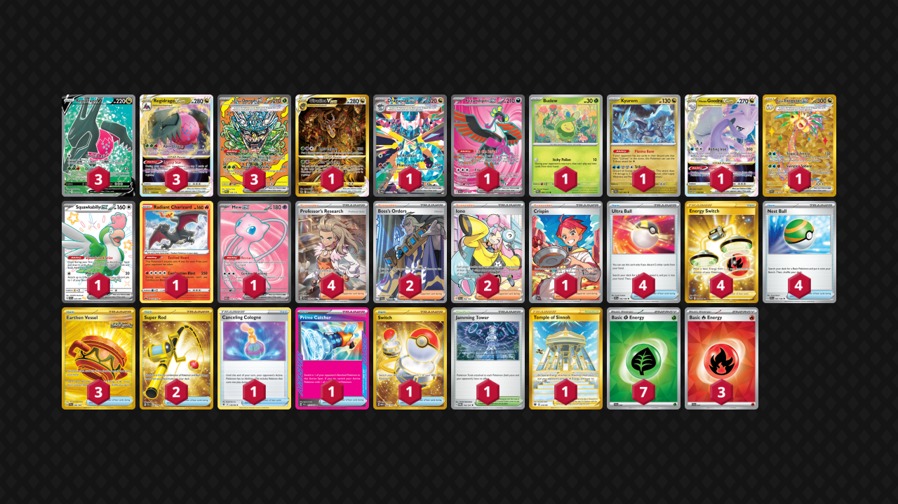

# Regidrago/Ogerpon

Tier **2** | Difficulty: **Hard** | Gameplan: **Midrange Toolbox**

**Source**: Fernando Elias Vega - [Top 64 Regional Mérida](https://limitlesstcg.com/decks/list/15780)

## List
* 1 Giratina VSTAR CRZ-GG 69
* 1 Dragapult ex PRE 165
* 1 Fezandipiti ex SFA 84
* 1 Budew PRE 4 PH
* 1 Kyurem SFA 47
* 3 Teal Mask Ogerpon ex PRE 145
* 3 Regidrago VSTAR SIT 136
* 3 Regidrago V SIT 183
* 1 Hisuian Goodra VSTAR LOR 136
* 1 Alolan Exeggutor ex SSP 248
* 1 Squawkabilly ex PAF 223
* 1 Radiant Charizard CRZ 20
* 1 Mew ex MEW 193
* 4 Ultra Ball SVI 196
* 3 Earthen Vessel SFA 96
* 1 Canceling Cologne ASR 136
* 2 Super Rod PAL 276
* 1 Jamming Tower TWM 153
* 2 Boss's Orders PAL 248
* 4 Energy Switch SIT 212
* 1 Crispin SCR 164
* 1 Prime Catcher TEF 157
* 4 Professor's Research SVI 240
* 1 Temple of Sinnoh ASR 214
* 2 Iono PAL 254
* 4 Nest Ball SVI 181
* 1 Switch MEW 206
* 3 Basic {R} Energy SVE 10
* 7 Basic {G} Energy SVE 9