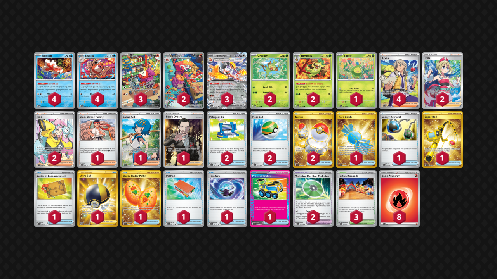

# Seaking/Skeledirge

Tier **F** | Difficulty: **Hard** | Gameplan: **Combo Midrange**

**Source**: D3AD_M4N14C - TrickyGym discord

## List
* 4 Seaking PRE 21
* 2 Thwackey TWM 15
* 1 Budew PRE 4
* 2 Crocalor PAL 202
* 2 Grookey TWM 14
* 3 Fuecoco PAL 201
* 4 Goldeen TWM 44
* 3 Skeledirge ex PAR 137
* 1 Rare Candy SVI 256
* 2 Irida ASR 186
* 4 Arven SVI 235
* 1 Black Belt's Training PRE 98
* 1 Energy Retrieval SVI 171
* 1 Super Rod PAL 276
* 1 Letter of Encouragement OBF 189
* 1 Ultra Ball BRS 186
* 2 Technical Machine: Evolution PAR 178
* 2 Pokégear 3.0 SVI 186
* 1 Buddy-Buddy Poffin TWM 223
* 1 Pal Pad SVI 182
* 2 Iono PAL 254
* 2 Nest Ball SVI 181
* 1 Tera Orb SSP 189
* 1 Lana's Aid TWM 207
* 1 Precious Trolley SSP 185
* 1 Boss's Orders RCL 189
* 2 Switch MEW 206
* 3 Festival Grounds TWM 149
* 8 Basic {R} Energy SVE 2