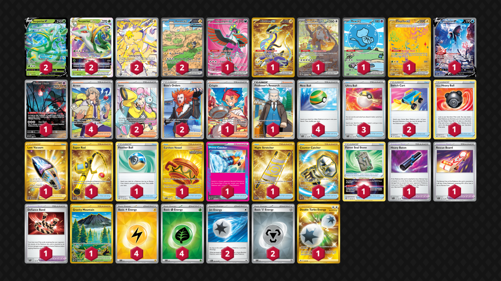

# Serperior/Joltik

Tier **F** | Difficulty: **Hard** | Gameplan: **Toolbox**

**Source**: mine - [Top 16 City League Chiba 01/11](https://limitlesstcg.com/decks/list/jp/25619)

## List
* 2 Serperior VSTAR SIT 8
* 1 Fezandipiti ex SFA 84
* 1 Miraidon ex SVI 253
* 2 Serperior V SIT 7
* 2 Joltik SCR 150
* 1 Bloodmoon Ursaluna ex TWM 216
* 1 Mew ex PAF 232
* 1 Pikachu ex PRE 179
* 1 Lumineon V BRS 156
* 2 Iron Hands ex PAR 248
* 1 Flutter Mane PR-SV 97
* 1 Hisuian Heavy Ball ASR 146
* 1 Crispin SCR 164
* 2 Switch Cart ASR 154
* 1 Lost Vacuum LOR 217
* 2 Iono PAL 254
* 1 Super Rod PAL 276
* 1 Forest Seal Stone SIT 156
* 1 Professor's Research CRZ 150
* 2 Boss's Orders LOR-TG 24
* 1 Feather Ball ASR 141
* 1 Earthen Vessel SFA 96
* 1 Heavy Baton TEF 151
* 1 Prime Catcher TEF 157
* 1 Rescue Board TEF 159
* 4 Nest Ball SVI 181
* 1 Gravity Mountain SSP 250
* 1 Night Stretcher SSP 251
* 4 Arven SVI 235
* 1 Defiance Band SVI 169
* 1 Counter Catcher PAR 264
* 3 Ultra Ball SVI 196
* 4 Basic {L} Energy SVE 12
* 2 Jet Energy PAL 190
* 1 Double Turbo Energy ASR 216
* 4 Basic {G} Energy SVE 9
* 2 Basic {M} Energy SVE 16