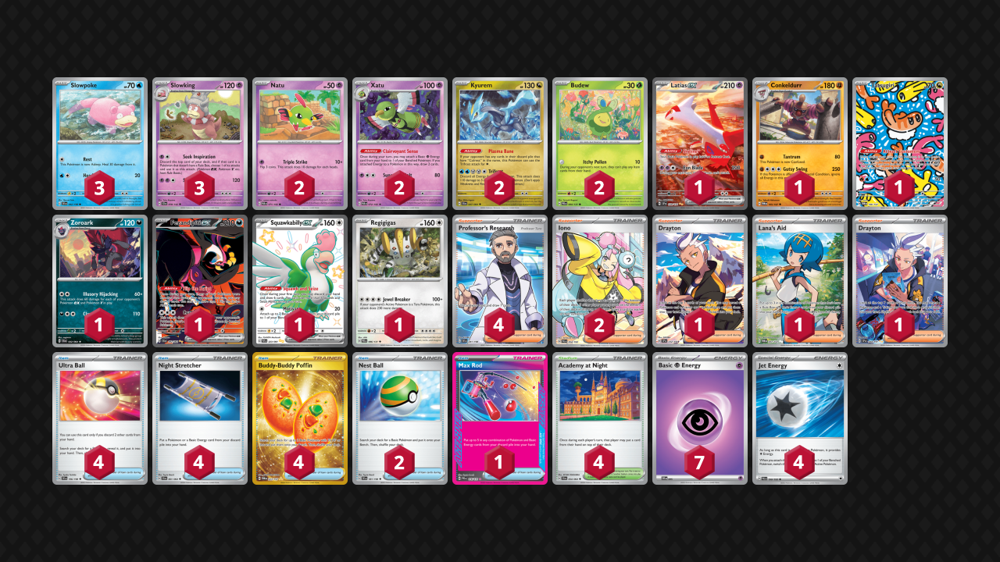

# Slowking/Xatu

Tier **3** | Difficulty: **Hard** | Gameplan: **Midrange Toolbox**

**Source**: 働く引きこもり、 - [Top 8 City League Ōsaka 02/04](https://limitlesstcg.com/decks/list/jp/28929)

## List
* 2 Xatu PAR 72
* 1 Latias ex SSP 239
* 1 Conkeldurr TWM 105
* 3 Slowpoke SVI 42
* 1 Tatsugiri TWM 186
* 2 Kyurem SFA 47
* 1 Zoroark SFA 32
* 1 Fezandipiti ex SFA 92
* 2 Natu PAR 71
* 2 Budew PRE 4
* 1 Squawkabilly ex PAF 223
* 3 Slowking SCR 58
* 1 Regigigas PRE 86
* 4 Ultra Ball SVI 196
* 4 Academy at Night SFA 54
* 1 Drayton SSP 232
* 4 Night Stretcher SFA 61
* 4 Professor's Research SVI 241
* 4 Buddy-Buddy Poffin TWM 223
* 1 Max Rod PRE 116
* 2 Iono PAL 254
* 2 Nest Ball SVI 181
* 1 Lana's Aid TWM 207
* 1 Drayton SSP 244
* 7 Basic {P} Energy SVE 5
* 4 Jet Energy PAL 190