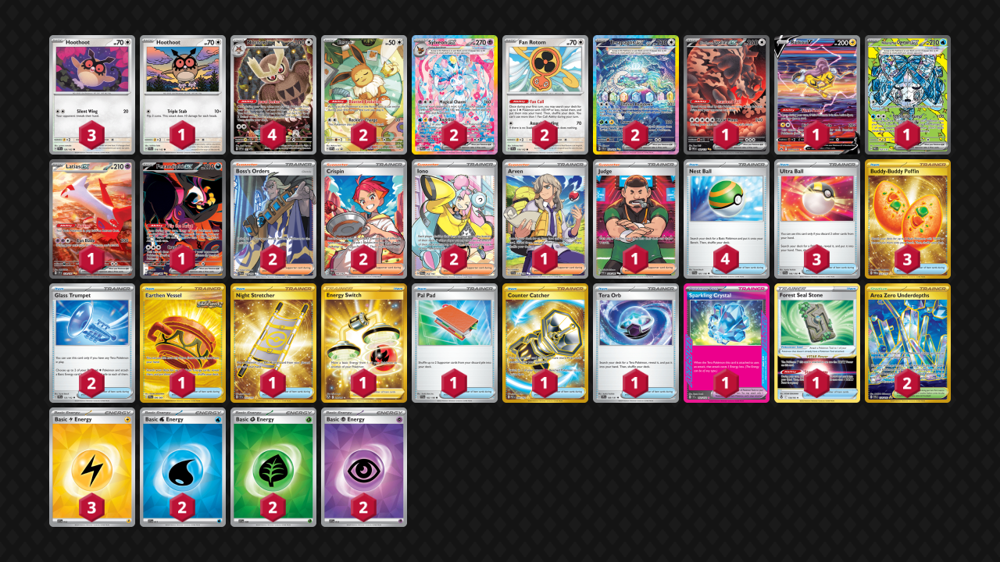

# Sylveon/Terapagos

Tier **3** | Difficulty: **Hard** | Gameplan: **Midrange Disruption**

**Source**: Arturo Ortega - [Day 2 Regional Mérida](https://limitlesstcg.com/decks/list/15898)

## List
* 1 Bloodmoon Ursaluna ex PRE 168
* 1 Raikou V CRZ-GG 41
* 1 Wellspring Mask Ogerpon ex PRE 152
* 2 Sylveon ex PRE 156
* 1 Latias ex SSP 239
* 3 Hoothoot TEF 126
* 1 Hoothoot SCR 114
* 1 Fezandipiti ex SFA 92
* 2 Fan Rotom SCR 118
* 2 Terapagos ex SCR 170
* 2 Eevee PR-SV 173
* 4 Noctowl PR-SV 141
* 3 Ultra Ball SVI 196
* 1 Arven SVI 235
* 1 Earthen Vessel SFA 96
* 2 Glass Trumpet SCR 135
* 1 Night Stretcher SSP 251
* 2 Boss's Orders PAL 248
* 1 Energy Switch SIT 212
* 2 Crispin SCR 164
* 3 Buddy-Buddy Poffin TWM 223
* 1 Pal Pad SVI 182
* 1 Sparkling Crystal SCR 142
* 1 Forest Seal Stone SIT 156
* 2 Iono PAL 254
* 4 Nest Ball SVI 181
* 2 Area Zero Underdepths SCR 174
* 1 Counter Catcher PAR 264
* 1 Tera Orb SSP 189
* 1 Judge PAF 228
* 2 Basic {W} Energy SVE 11
* 3 Basic {L} Energy SVE 12
* 2 Basic {G} Energy SVE 9
* 2 Basic {P} Energy SVE 13