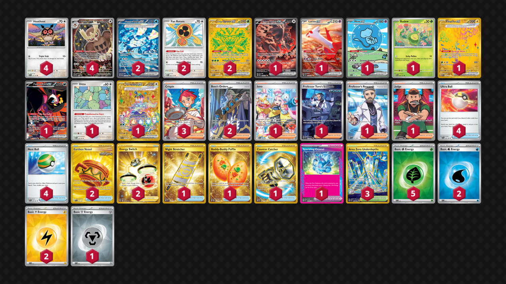

# Terabox

Tier **4** | Difficulty: **Hard** | Gameplan: **Toolbox**

**Source**: frogger28 - TrickyGym discord

## List
* 1 Bloodmoon Ursaluna ex PRE 168
* 2 Wellspring Mask Ogerpon ex TWM 213
* 1 Latias ex SSP 239
* 1 Mew ex PAF 232
* 2 Fan Rotom PRE 85
* 1 Budew PRE 4
* 1 Pikachu ex PRE 179
* 4 Hoothoot SCR 114
* 1 Fezandipiti ex SFA 92
* 1 Ditto MEW 132
* 1 Terapagos ex SCR 173
* 2 Teal Mask Ogerpon ex PRE 177
* 4 Noctowl PR-SV 141
* 4 Ultra Ball SVI 196
* 2 Earthen Vessel SFA 96
* 1 Iono PAL 269
* 1 Night Stretcher SSP 251
* 1 Professor Turo's Scenario PAR 257
* 2 Boss's Orders PAL 248
* 2 Energy Switch SIT 212
* 1 Sparkling Crystal PRE 129
* 3 Crispin SCR 164
* 1 Professor's Research SVI 241
* 1 Buddy-Buddy Poffin TWM 223
* 3 Area Zero Underdepths SCR 174
* 4 Nest Ball PAF 84
* 1 Counter Catcher PAR 264
* 1 Judge PAF 228
* 2 Basic {W} Energy SVE 11
* 2 Basic {L} Energy SVE 12
* 5 Basic {G} Energy SVE 9
* 1 Basic {M} Energy SVE 16