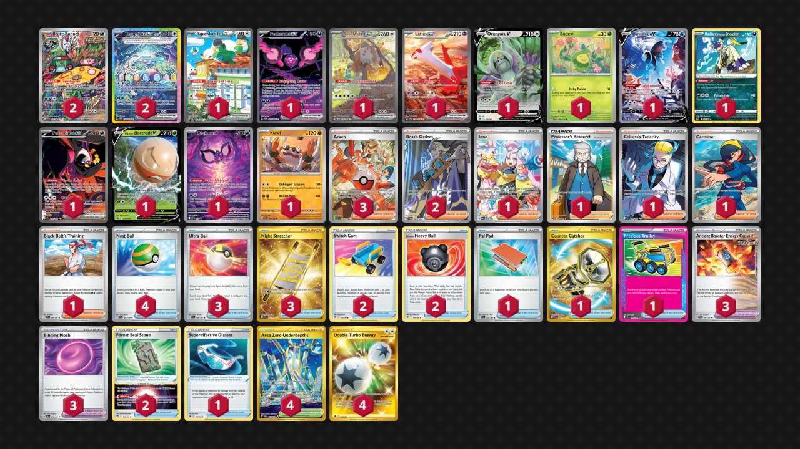

# Terapagos/Klawf

Tier **2** | Difficulty: **Hard** | Gameplan: **Aggro Midrange**

**Source**: Rolando Gabriel Coronado Jimenez - [Top 4 Regional Mérida](https://limitlesstcg.com/decks/list/15738)

## List
* 1 Squawkabilly ex PAL 264
* 1 Pecharunt ex SFA 93
* 1 Bloodmoon Ursaluna ex TWM 216
* 1 Latias ex SSP 239
* 2 Brute Bonnet PAR 207
* 1 Oranguru V ASR 133
* 1 Budew PRE 4
* 1 Lumineon V BRS 156
* 1 Radiant Hisuian Sneasler LOR 123
* 1 Fezandipiti ex SFA 92
* 2 Terapagos ex SCR 170
* 1 Hisuian Electrode V PR-SW 294
* 1 Pecharunt PR-SV 129
* 1 Klawf PAR 105
* 3 Ultra Ball SVI 196
* 2 Switch Cart ASR 154
* 3 Ancient Booster Energy Capsule TEF 140
* 2 Hisuian Heavy Ball ASR 146
* 3 Arven PAF 235
* 1 Iono PAL 269
* 3 Night Stretcher SSP 251
* 2 Boss's Orders PAL 248
* 1 Professor's Research CRZ 150
* 1 Pal Pad SVI 182
* 1 Colress's Tenacity SFA 87
* 2 Forest Seal Stone SIT 156
* 4 Nest Ball SVI 181
* 4 Area Zero Underdepths SCR 174
* 1 Supereffective Glasses ASR 152
* 1 Counter Catcher PAR 264
* 1 Carmine TWM 204
* 1 Precious Trolley SSP 185
* 3 Binding Mochi SFA 55
* 1 Black Belt's Training PRE 99
* 4 Double Turbo Energy ASR 216