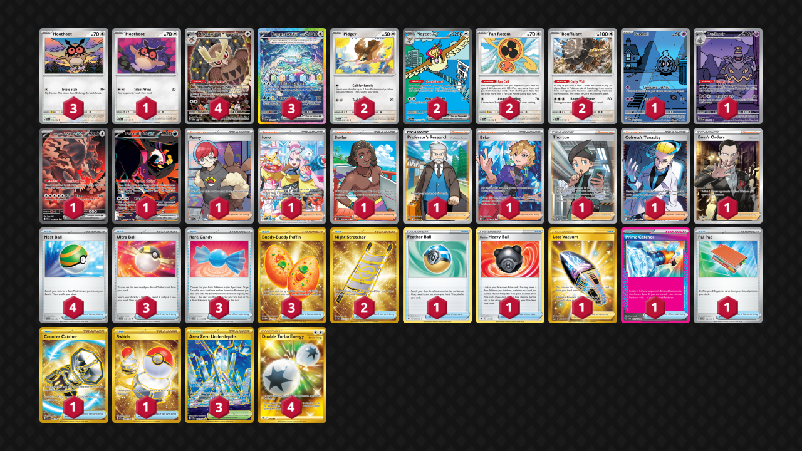

# Terapagos/Noctowl

Tier **2** | Difficulty: **Hard** | Gameplan: **Combo Midrange**

**Source**: Agustín Herrera Garcia - [Day 2 Regional Mérida](https://limitlesstcg.com/decks/list/15804)

## List
* 1 Bloodmoon Ursaluna ex PRE 168
* 2 Pidgeot ex OBF 225
* 1 Hoothoot TEF 126
* 1 Duskull SFA 68
* 3 Hoothoot SCR 114
* 1 Fezandipiti ex SFA 92
* 2 Fan Rotom SCR 118
* 3 Terapagos ex SCR 170
* 2 Bouffalant SCR 119
* 4 Noctowl PR-SV 141
* 1 Dusknoir SFA 70
* 2 Pidgey MEW 16
* 3 Ultra Ball SVI 196
* 3 Rare Candy SVI 191
* 1 Feather Ball ASR 141
* 1 Hisuian Heavy Ball ASR 146
* 1 Penny SVI 239
* 1 Iono PAL 269
* 2 Night Stretcher SSP 251
* 1 Surfer SSP 235
* 1 Professor's Research CRZ 150
* 1 Briar SCR 163
* 1 Lost Vacuum LOR 217
* 1 Thorton LOR 195
* 3 Buddy-Buddy Poffin TWM 223
* 1 Prime Catcher TEF 157
* 1 Pal Pad SVI 182
* 1 Colress's Tenacity SFA 87
* 4 Nest Ball SVI 181
* 3 Area Zero Underdepths SCR 174
* 1 Counter Catcher PAR 264
* 1 Boss's Orders RCL 189
* 1 Switch MEW 206
* 4 Double Turbo Energy ASR 216