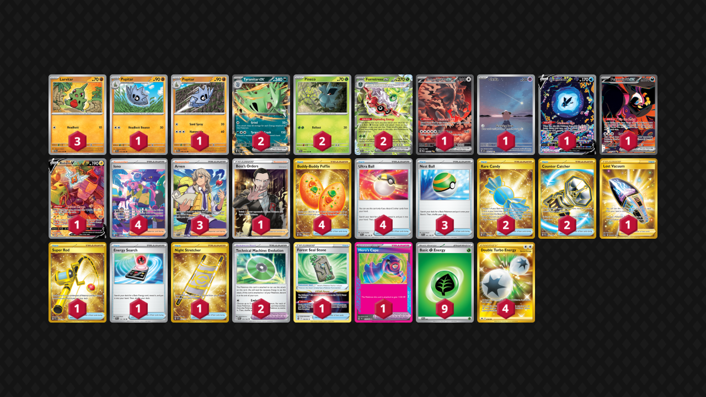

# Tyranitar/Forretress

Tier **F** | Difficulty: **Easy** | Gameplan: **Midrange**

**Source**: grayant213 - TrickyGym discord

## List
* 2 Pineco PAL 4
* 1 Bloodmoon Ursaluna ex PRE 168
* 1 Cleffa OBF 202
* 2 Forretress ex PAF 2
* 1 Lumineon V CRZ-GG 39
* 1 Fezandipiti ex SFA 92
* 3 Larvitar PRE 47
* 1 Rotom V LOR 177
* 1 Pupitar PAL 111 PH
* 2 Tyranitar ex PRE 64
* 1 Pupitar PRE 48
* 1 Boss's Orders RCL 189
* 4 Buddy-Buddy Poffin TWM 223
* 1 Lost Vacuum LOR 217
* 1 Super Rod PAL 276
* 1 Forest Seal Stone SIT 156
* 1 Energy Search SVI 172
* 1 Hero's Cape TEF 152
* 2 Rare Candy SVI 256
* 3 Nest Ball SVI 181
* 4 Iono PAF 237
* 1 Night Stretcher SSP 251
* 2 Technical Machine: Evolution PAR 178
* 3 Arven SVI 235
* 2 Counter Catcher PAR 264
* 4 Ultra Ball SVI 196
* 9 Basic {G} Energy SVE 1
* 4 Double Turbo Energy ASR 216