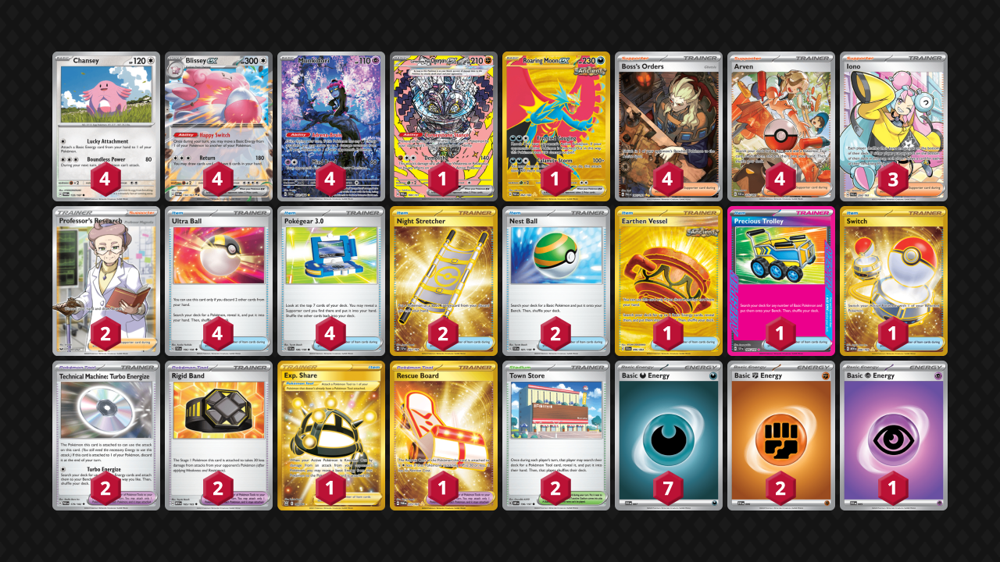
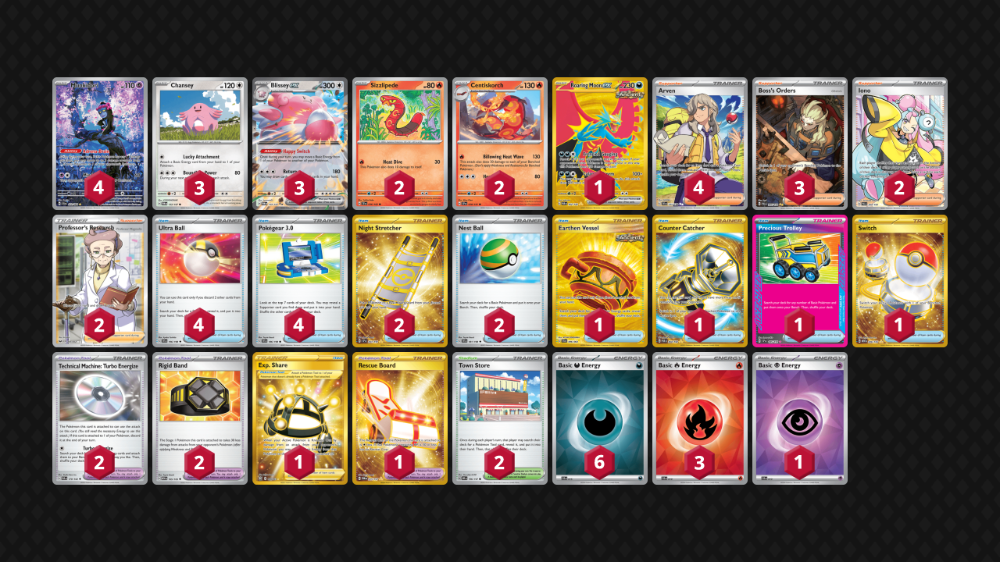

# Blissey/Munkidori

* [Cornerstone Mask Ogerpon ex](#cornerstone-mask-ogerpon-ex)
* [Billowing Heat Wave Centiskorch](#billowing-heat-wave-centiskorch)

## Cornerstone Mask Ogerpon ex

Tier **2** | Difficulty: **Moderate** | Gameplan: **Tank and Heal**

**Source**: Fernando Cifuentes - [2nd Place Regional Monterrey](https://limitlesstcg.com/decks/list/17098)

[top](#blisseymunkidori)

## List
* 1 Cornerstone Mask Ogerpon ex PRE 160
* 4 Chansey TWM 133
* 4 Blissey ex TWM 134
* 4 Munkidori SFA 72
* 1 Roaring Moon ex PAR 262
* 4 Ultra Ball SVI 196
* 1 Earthen Vessel SFA 96
* 4 Boss's Orders PAL 265
* 4 Arven PAF 235
* 2 Night Stretcher SSP 251
* 1 Exp. Share BST 180
* 2 Technical Machine: Turbo Energize PAR 179
* 2 Rigid Band MEW 165
* 2 Town Store OBF 196
* 4 Pokégear 3.0 SVI 186
* 3 Iono PAL 254
* 2 Nest Ball SVI 181
* 1 Rescue Board TWM 225
* 1 Precious Trolley SSP 185
* 1 Switch MEW 206
* 2 Professor's Research SSH 201
* 7 Basic {D} Energy SVE 7
* 2 Basic {F} Energy SVE 6
* 1 Basic {P} Energy SVE 5

## Billowing Heat Wave Centiskorch

Tier **3** | Difficulty: **Hard** | Gameplan: **Tank and Heal**

**Source**: Julian Luvara - [Top 64 Regional Melbourne](https://limitlesstcg.com/decks/list/17715)

[top](#blisseymunkidori)

## List
* 2 Sizzlipede TEF 36
* 2 Centiskorch SSP 28
* 3 Chansey TWM 133
* 3 Blissey ex TWM 134
* 4 Munkidori SFA 72
* 1 Roaring Moon ex PAR 262
* 4 Ultra Ball SVI 196
* 4 Arven SVI 235
* 1 Earthen Vessel SFA 96
* 3 Boss's Orders PAL 265
* 2 Night Stretcher SSP 251
* 1 Exp. Share BST 180
* 2 Technical Machine: Turbo Energize PAR 179
* 2 Rigid Band MEW 165
* 2 Town Store OBF 196
* 4 Pokégear 3.0 SVI 186
* 2 Iono PAL 254
* 2 Nest Ball SVI 181
* 1 Rescue Board TWM 225
* 1 Counter Catcher PAR 264
* 1 Precious Trolley SSP 185
* 1 Switch MEW 206
* 2 Professor's Research SSH 201
* 6 Basic {D} Energy SVE 15
* 3 Basic {R} Energy SVE 10
* 1 Basic {P} Energy SVE 13
