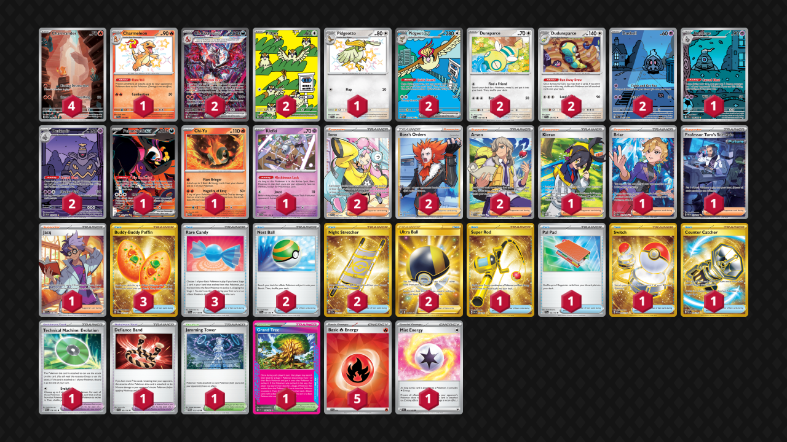

# Charizard/Pidgeot

Tier **3** | Difficulty: **Hard** | Gameplan: **Accumulate**

**Source**: Brian Wade - [Top 64 Regional Atlanta, GA](https://limitlesstcg.com/decks/list/16856)

## List
* 2 Pidgey OBF 207
* 1 Charmeleon PAF 110
* 2 Pidgeot ex OBF 225
* 2 Dudunsparce TEF 129
* 1 Fezandipiti ex SFA 92
* 4 Charmander MEW 168
* 2 Dunsparce PAL 156
* 1 Chi-Yu PAR 29
* 2 Duskull SFA 68
* 1 Pidgeotto PAF 197
* 2 Charizard ex PAF 234
* 1 Dusclops SFA 69
* 1 Klefki SVI 96
* 2 Dusknoir SFA 70
* 1 Kieran TWM 206
* 3 Buddy-Buddy Poffin TWM 223
* 1 Briar SCR 163
* 2 Iono PAL 254
* 1 Super Rod PAL 276
* 1 Professor Turo's Scenario PAR 257
* 2 Boss's Orders LOR-TG 24
* 1 Pal Pad SVI 182
* 2 Nest Ball SVI 181
* 1 Switch MEW 206
* 1 Jamming Tower TWM 153
* 2 Night Stretcher SSP 251
* 1 Technical Machine: Evolution PAR 178
* 2 Arven SVI 235
* 2 Ultra Ball BRS 186
* 1 Jacq SVI 236
* 1 Defiance Band SVI 169
* 1 Counter Catcher PAR 264
* 1 Grand Tree SCR 136
* 3 Rare Candy SVI 191
* 5 Basic {R} Energy SVE 10
* 1 Mist Energy TEF 161