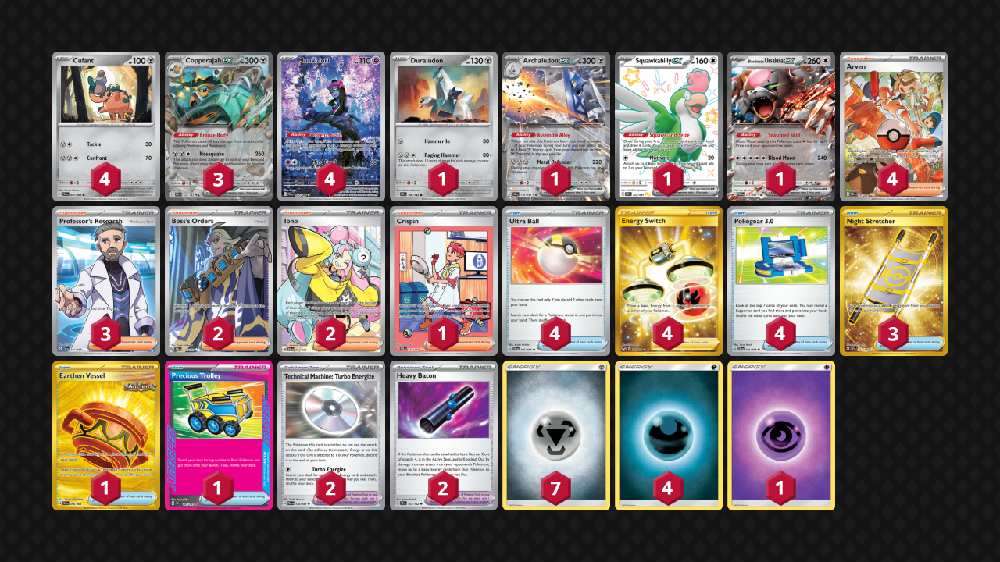

# Copperajah/Munkidori

Tier **3** | Difficulty: **Moderate** | Gameplan: **Midrange**

**Source**: amcharles1 - [Top 8 🐢Turtle Weekly 19🐢](https://play.limitlesstcg.com/tournament/67d733bc9561463c337210a3/player/amcharles1/decklist)

## List
* 1 Duraludon SCR 106
* 3 Copperajah ex PAL 150
* 4 Cufant SFA 41 PH
* 4 Munkidori SFA 72
* 1 Squawkabilly ex PAF 223
* 1 Bloodmoon Ursaluna ex TWM 141
* 1 Archaludon ex SSP 130
* 4 Ultra Ball SVI 196
* 1 Earthen Vessel SFA 96
* 4 Arven PAF 235
* 3 Night Stretcher SSP 251
* 2 Boss's Orders PAL 248
* 2 Technical Machine: Turbo Energize PAR 179
* 4 Energy Switch SIT 212
* 2 Heavy Baton TEF 151
* 4 Pokégear 3.0 SVI 186
* 3 Professor's Research SVI 241
* 2 Iono PAL 254
* 1 Crispin PRE 171
* 1 Precious Trolley SSP 185
* 4 Basic {D} Energy Energy 24
* 7 Basic {M} Energy Energy 16
* 1 Basic {P} Energy Energy 22