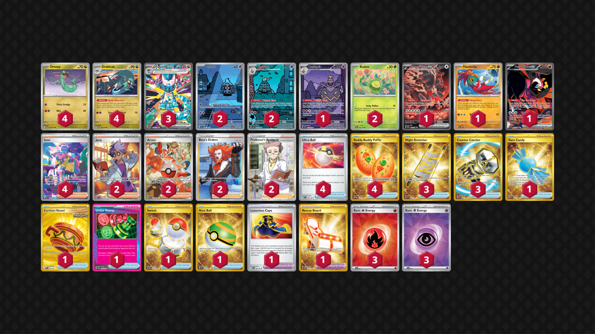

# Dragapult/Dusknoir

Tier **1** | Difficulty: **Hard** | Gameplan: **Accumulate Spread**

**Source**: Andrew Hedrick - [2nd Place Regional Atlanta, GA](https://limitlesstcg.com/decks/list/16829)

## List
* 1 Bloodmoon Ursaluna ex PRE 168
* 3 Dragapult ex PRE 165
* 4 Drakloak TWM 129
* 4 Dreepy TWM 128
* 2 Dusclops SFA 69
* 1 Hawlucha PR-SV 7
* 2 Duskull SFA 68
* 1 Fezandipiti ex SFA 92
* 2 Budew PRE 4
* 1 Dusknoir SFA 70
* 1 Rare Candy SVI 256
* 4 Ultra Ball SVI 196
* 1 Earthen Vessel SFA 96
* 2 Jacq SVI 236
* 2 Arven PAF 235
* 1 Luxurious Cape PAR 166
* 4 Iono PAF 237
* 3 Night Stretcher SSP 251
* 2 Boss's Orders LOR-TG 24
* 4 Buddy-Buddy Poffin TWM 223
* 1 Rescue Board TWM 225
* 3 Counter Catcher PAR 264
* 1 Unfair Stamp TWM 165
* 1 Switch MEW 206
* 2 Professor's Research SSH 201
* 1 Nest Ball SVI 255
* 3 Basic {R} Energy SVE 10
* 3 Basic {P} Energy SVE 13