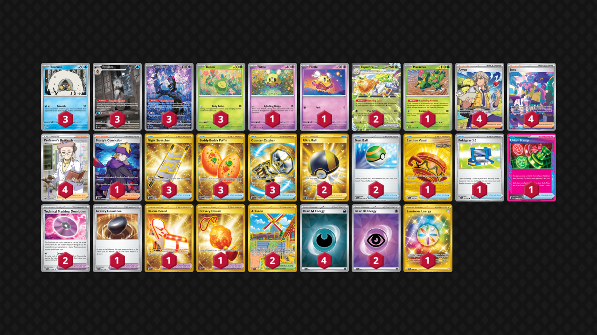

# Espathra/Froslass

Tier **3** | Difficulty: **Hard** | Gameplan: **Disruption Spread**

**Source**: Israel Sosa - [Top 128 Regional Atlanta, GA](https://limitlesstcg.com/decks/list/16917)

## List
* 1 Maractus JTG 8
* 2 Espathra ex PAF 6
* 3 Munkidori SFA 72
* 1 Flittle SSP 94
* 3 Budew PRE 4
* 3 Snorunt TWM 51
* 1 Flittle SCR 68
* 3 Froslass TWM 174
* 4 Arven SVI 235
* 1 Morty's Conviction TEF 201
* 1 Earthen Vessel SFA 96
* 4 Iono PAF 237
* 1 Gravity Gemstone SCR 137
* 3 Night Stretcher SSP 251
* 2 Technical Machine: Devolution PAR 177
* 2 Ultra Ball BRS 186
* 2 Artazon OBF 229
* 1 Pokégear 3.0 SVI 186
* 3 Buddy-Buddy Poffin TWM 223
* 2 Nest Ball SVI 181
* 1 Rescue Board TWM 225
* 3 Counter Catcher PAR 264
* 1 Unfair Stamp TWM 165
* 1 Bravery Charm SCR 175
* 4 Professor's Research SSH 201
* 4 Basic {D} Energy SVE 15
* 2 Basic {P} Energy SVE 13
* 1 Luminous Energy TWM 226