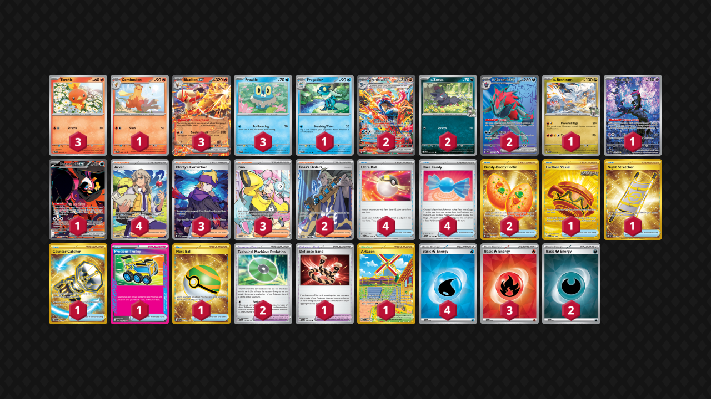

# Greninja/Blaziken

Tier **3** | Difficulty: **Hard** | Gameplan: **Accumulate Toolbox**

**Source**: Ben Hays - [Top 128 Regional Atlanta, GA](https://limitlesstcg.com/decks/list/16903)

## List
* 2 N's Zorua JTG 97
* 1 N's Reshiram JTG 116
* 3 Blaziken ex JTG 24
* 2 N's Zoroark ex JTG 175
* 2 Greninja ex TWM 214
* 3 Torchic JTG 22
* 1 Munkidori SFA 72
* 1 Combusken JTG 23
* 1 Fezandipiti ex SFA 92
* 1 Frogadier TWM 57
* 3 Froakie OBF 56
* 4 Ultra Ball SVI 196
* 4 Arven SVI 235
* 3 Morty's Conviction TEF 201
* 1 Earthen Vessel SFA 96
* 4 Rare Candy SVI 191
* 1 Defiance Band SVI 169
* 1 Night Stretcher SSP 251
* 2 Boss's Orders PAL 248
* 2 Technical Machine: Evolution PAR 178
* 1 Artazon OBF 229
* 2 Buddy-Buddy Poffin TWM 223
* 3 Iono PAL 254
* 1 Counter Catcher PAR 264
* 1 Precious Trolley SSP 185
* 1 Nest Ball SVI 255
* 4 Basic {W} Energy SVE 11
* 2 Basic {D} Energy SVE 15
* 3 Basic {R} Energy SVE 10