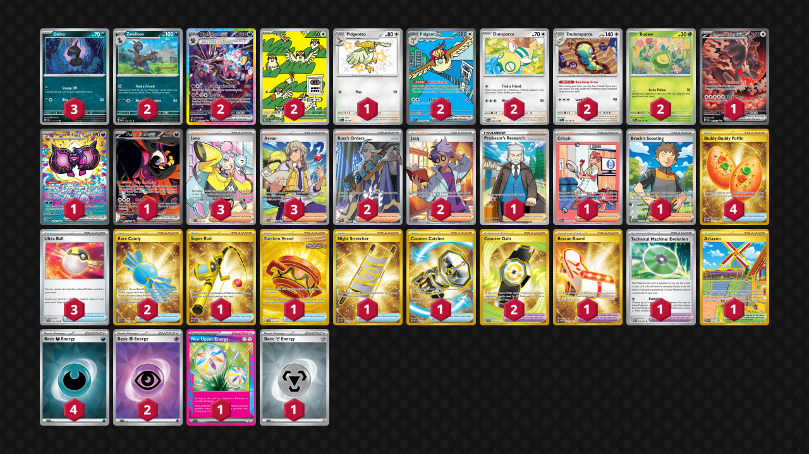

# Hydreigon/Pidgeot

Tier **3** | Difficulty: **Hard** | Gameplan: **Accumulate**

**Source**: Maciej Chojnacki - [Top 64  Special Event Sevilla](https://limitlesstcg.com/decks/list/17342)

## List
* 3 Deino SSP 117
* 2 Pidgey OBF 207
* 1 Bloodmoon Ursaluna ex PRE 168
* 2 Hydreigon ex SSP 240
* 2 Pidgeot ex OBF 225
* 1 Pecharunt ex PRE 163
* 2 Dudunsparce TEF 129
* 1 Fezandipiti ex SFA 92
* 2 Dunsparce PAL 156
* 1 Pidgeotto PAF 197
* 2 Budew PRE 4
* 2 Zweilous PAL 139
* 4 Buddy-Buddy Poffin TWM 223
* 2 Counter Gain SSP 249
* 1 Rescue Board TWM 225
* 3 Iono PAL 254
* 1 Super Rod PAL 276
* 1 Artazon OBF 229
* 1 Professor's Research CRZ 150
* 1 Earthen Vessel SFA 96
* 2 Rare Candy SVI 256
* 1 Night Stretcher SSP 251
* 1 Crispin PRE 171
* 2 Boss's Orders PAL 248
* 1 Technical Machine: Evolution PAR 178
* 3 Arven SVI 235
* 2 Jacq SVI 236
* 1 Counter Catcher PAR 264
* 1 Brock's Scouting JTG 179
* 3 Ultra Ball SVI 196
* 4 Basic {D} Energy SVE 15
* 2 Basic {P} Energy SVE 13
* 1 Neo Upper Energy TEF 162
* 1 Basic {M} Energy SVE 16