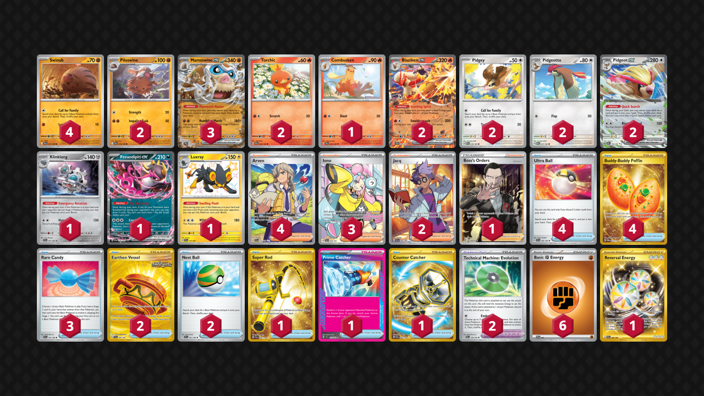
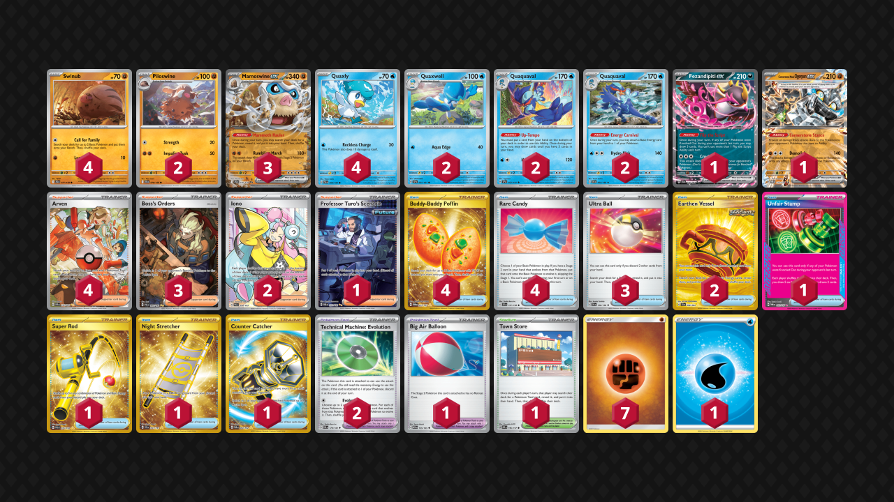
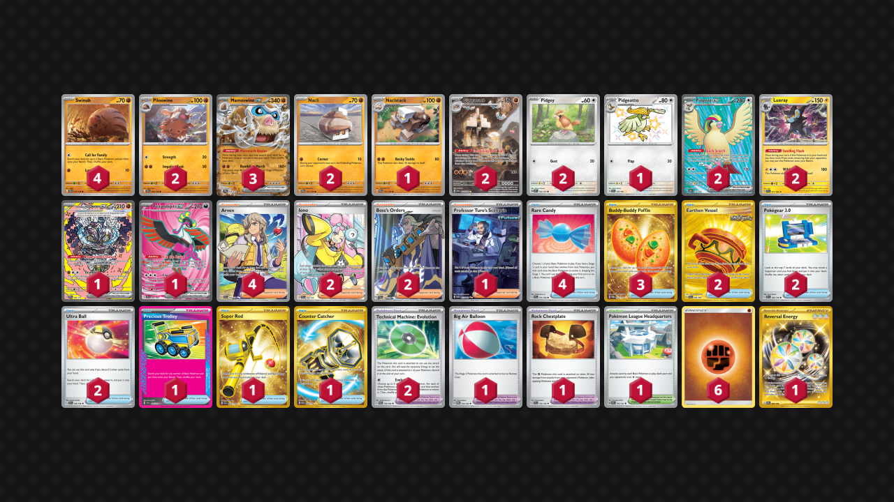

# Mamoswine ex

* [Blaziken ex](#blaziken-ex)
* [Quaquaval](#quaquaval)
* [Energizing Rock Salt Garganacl](#energizing-rock-salt-garganacl)

## Blaziken ex

Tier **3** | Difficulty: **Moderate** | Gameplan: **Accumulate**

**Source**: すすむ@ - [Top 8 City League Tōkyō 03/26](https://limitlesstcg.com/decks/list/jp/34815)

[top](#mamoswine-ex)

## List
* 4 Swinub JTG 77
* 2 Blaziken ex JTG 24
* 1 Klinklang SCR 101
* 2 Torchic JTG 22
* 2 Pidgeotto MEW 17
* 2 Pidgeot ex OBF 164
* 2 Piloswine JTG 78
* 1 Combusken JTG 23
* 1 Fezandipiti ex SFA 38
* 1 Luxray PAF 137
* 2 Pidgey MEW 16
* 3 Mamoswine ex JTG 79
* 4 Ultra Ball SVI 196
* 4 Arven SVI 235
* 2 Earthen Vessel SFA 96
* 2 Jacq SVI 236
* 3 Rare Candy SVI 191
* 1 Super Rod PAL 276
* 2 Technical Machine: Evolution PAR 178
* 4 Buddy-Buddy Poffin TWM 223
* 1 Prime Catcher TEF 157
* 3 Iono PAL 254
* 2 Nest Ball SVI 181
* 1 Counter Catcher PAR 264
* 1 Boss's Orders RCL 189
* 6 Basic {F} Energy SVE 6
* 1 Reversal Energy PAR 266

## Quaquaval

Tier **5** | Difficulty: **Moderate** | Gameplan: **Accumulate**

**Source**: きんぎょ - [Top 16 City League Hyōgo 02/01](https://limitlesstcg.com/decks/list/jp/28192)

[top](#mamoswine-ex)

## List
* 3 Mamoswine ex JTG 79
* 2 Quaquaval SSP 52
* 4 Swinub JTG 77
* 1 Fezandipiti ex SFA 38
* 2 Piloswine JTG 78
* 2 Quaxwell SSP 51
* 2 Quaquaval SVI 54
* 1 Cornerstone Mask Ogerpon ex TWM 112
* 4 Quaxly PAL 50
* 4 Buddy-Buddy Poffin TWM 223
* 1 Town Store OBF 196
* 2 Iono PAL 254
* 1 Unfair Stamp TWM 165
* 1 Super Rod PAL 276
* 1 Professor Turo's Scenario PAR 257
* 2 Earthen Vessel SFA 96
* 1 Big Air Balloon MEW 155
* 4 Arven PAF 235
* 3 Boss's Orders PAL 265
* 1 Night Stretcher SSP 251
* 2 Technical Machine: Evolution PAR 178
* 1 Counter Catcher PAR 264
* 3 Ultra Ball SVI 196
* 4 Rare Candy SVI 191
* 1 Basic {W} Energy Energy 47
* 7 Basic {F} Energy Energy 23

## Energizing Rock Salt Garganacl

Tier **F** | Difficulty: **Moderate** | Gameplan: **Accumulate**

**Source**: リバー - [1st Place City League Shizuoka 02/09](https://limitlesstcg.com/decks/list/jp/29864)

[top](#mamoswine-ex)

## List
* 3 Mamoswine ex JTG 79
* 1 Naclstack PAR 103
* 1 Cornerstone Mask Ogerpon ex PRE 160
* 2 Nacli PAR 102
* 1 Fezandipiti ex SFA 84
* 2 Luxray PAL 71
* 4 Swinub JTG 77
* 1 Pidgeotto PAF 197
* 2 Piloswine JTG 78
* 2 Pidgeot ex OBF 217
* 2 Pidgey OBF 162
* 2 Garganacl PAR 202
* 3 Buddy-Buddy Poffin TWM 223
* 2 Iono PAL 254
* 1 Pokémon League Headquarters OBF 192
* 1 Precious Trolley SSP 185
* 1 Super Rod PAL 276
* 1 Professor Turo's Scenario PAR 257
* 2 Earthen Vessel SFA 96
* 2 Pokégear 3.0 SVI 186
* 1 Big Air Balloon MEW 155
* 2 Boss's Orders PAL 248
* 2 Technical Machine: Evolution PAR 178
* 4 Arven SVI 235
* 1 Counter Catcher PAR 264
* 2 Ultra Ball SVI 196
* 1 Rock Chestplate SVI 192
* 4 Rare Candy SVI 191
* 6 Basic {F} Energy Energy 23
* 1 Reversal Energy PAR 266
