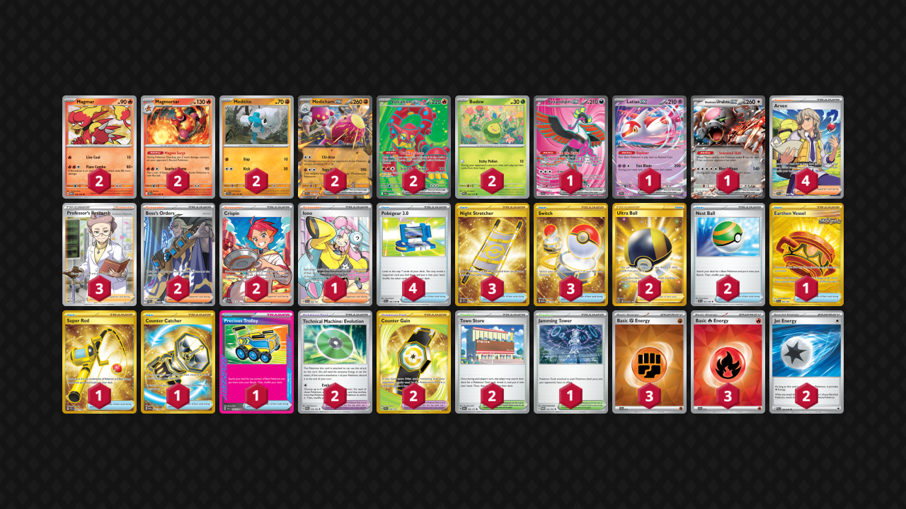

# Medicham/Magmortar

Tier **5** | Difficulty: **Moderate** | Gameplan: **Combo**

**Source**: paddy7771 - [Top 8 Jester's Weekly Casual #13](https://play.limitlesstcg.com/tournament/68244a594c6488b18ed5e85a/player/paddy7771/decklist)

## List
* 2 Magmar MEW 126
* 2 Volcanion ex JTG 171
* 1 Fezandipiti ex SFA 84
* 1 Latias ex SSP 76
* 2 Meditite TEF 82
* 2 Budew PRE 4
* 2 Medicham ex SCR 80
* 1 Bloodmoon Ursaluna ex TWM 141
* 2 Magmortar JTG 21
* 4 Arven SVI 235
* 1 Earthen Vessel SFA 96
* 1 Super Rod PAL 276
* 1 Jamming Tower TWM 153
* 3 Night Stretcher SSP 251
* 2 Boss's Orders PAL 248
* 2 Ultra Ball BRS 186
* 2 Technical Machine: Evolution PAR 178
* 2 Crispin SCR 164
* 2 Town Store OBF 196
* 4 Pokégear 3.0 SVI 186
* 1 Iono PAL 254
* 2 Nest Ball SVI 181
* 1 Counter Catcher PAR 264
* 2 Counter Gain SSP 249
* 1 Precious Trolley SSP 185
* 3 Switch MEW 206
* 3 Professor's Research SSH 201
* 3 Basic {F} Energy SVE 14
* 3 Basic {R} Energy SVE 10
* 2 Jet Energy PAL 190