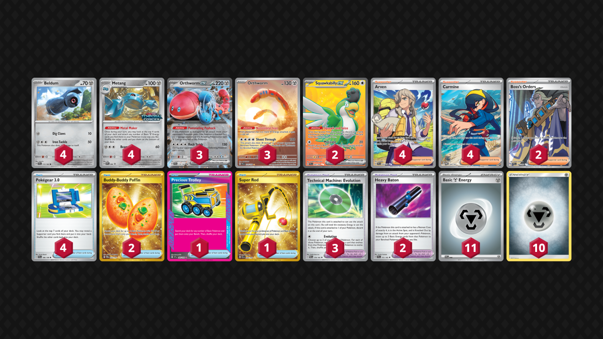

# Orthworm/Metang

Tier **F** | Difficulty: **Easy** | Gameplan: **Combo Midrange**

**Source**: Squall'sStorm - TrickyGym discord

## List
* 2 Squawkabilly ex PAL 247
* 3 Orthworm ex SCR 110
* 4 Metang PR-SV 90
* 3 Orthworm PAL 224
* 4 Beldum TEF 113
* 2 Buddy-Buddy Poffin TWM 223
* 1 Precious Trolley SSP 185
* 4 Pokégear 3.0 SVI 186
* 1 Super Rod PAL 276
* 3 Technical Machine: Evolution PAR 178
* 2 Boss's Orders PAL 248
* 4 Arven SVI 235
* 2 Heavy Baton TEF 151
* 4 Carmine TWM 204
* 10 Basic {M} Energy Energy 16
* 11 Basic {M} SVE 8