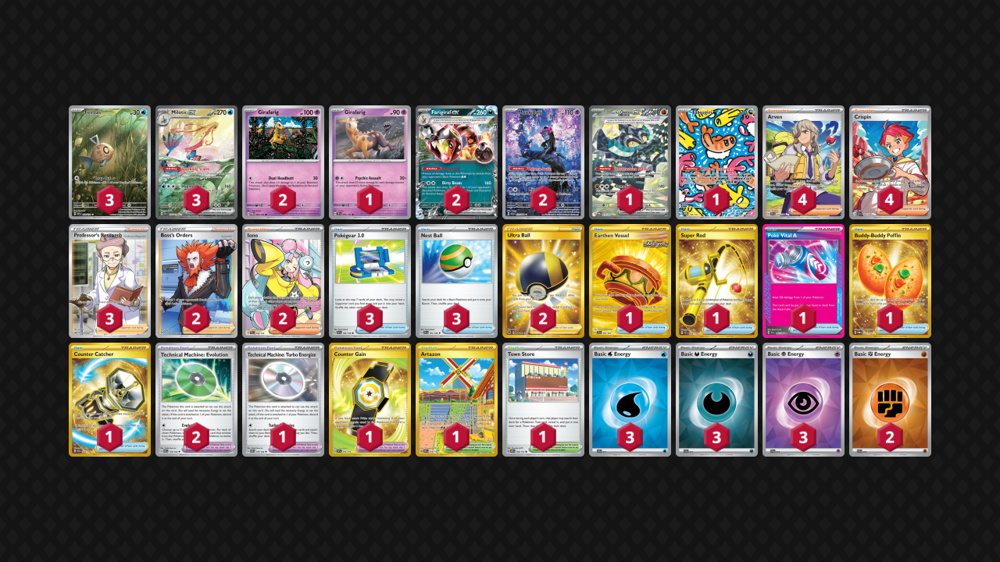

# Walls

Tier **2** | Difficulty: **Moderate** | Gameplan: **Stall**

**Source**: Yoshiki Kitae - [Top 4 Champions League Fukuoka](https://limitlesstcg.com/decks/list/15927)

## List
* 1 Girafarig TEF 66
* 3 Feebas SSP 198
* 1 Cornerstone Mask Ogerpon ex TWM 215
* 2 Girafarig TWM 83
* 3 Milotic ex SSP 237
* 1 Tatsugiri TWM 186
* 2 Munkidori SFA 72
* 2 Farigiraf ex TEF 108
* 4 Arven SVI 235
* 1 Earthen Vessel SFA 96
* 1 Super Rod PAL 276
* 2 Ultra Ball BRS 186
* 2 Boss's Orders LOR-TG 24
* 1 Poké Vital A SFA 62
* 1 Technical Machine: Turbo Energize PAR 179
* 2 Technical Machine: Evolution PAR 178
* 1 Artazon OBF 229
* 4 Crispin SCR 164
* 1 Town Store OBF 196
* 3 Pokégear 3.0 SVI 186
* 1 Buddy-Buddy Poffin TWM 223
* 2 Iono PAL 254
* 3 Nest Ball SVI 181
* 1 Counter Catcher PAR 264
* 1 Counter Gain SSP 249
* 3 Professor's Research SSH 201
* 3 Basic {W} Energy SVE 11
* 2 Basic {F} Energy SVE 14
* 3 Basic {D} Energy SVE 15
* 3 Basic {P} Energy SVE 13