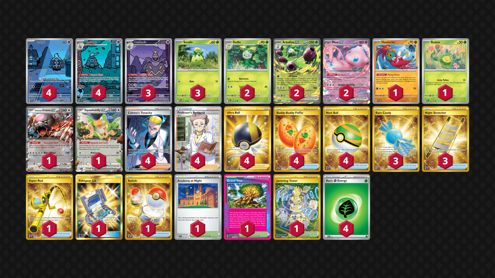

# Arboliva/Dusknoir

Tier **5** | Difficulty: **Easy** | Gameplan: **Turbo**

**Source**: きょーいち - [2nd Place City League Tochigi 04/20](https://limitlesstcg.com/decks/list/jp/37592)

## List
* 2 Arboliva ex DRI 23
* 2 Dolliv DRI 22
* 4 Dusclops SFA 69
* 1 Hawlucha PR-SV 7
* 2 Mew ex MEW 151
* 1 Budew PRE 4
* 4 Duskull SFA 68
* 3 Smoliv DRI 21
* 1 Bloodmoon Ursaluna ex TWM 141
* 1 Squawkabilly ex PAL 169
* 3 Dusknoir SFA 70
* 3 Rare Candy SVI 256
* 1 Academy at Night SFA 54
* 1 Grand Tree SCR 136
* 1 Super Rod PAL 276
* 3 Night Stretcher SSP 251
* 4 Ultra Ball BRS 186
* 4 Buddy-Buddy Poffin TWM 223
* 4 Colress's Tenacity SFA 87
* 1 Pokégear 3.0 UNB 233
* 1 Switch MEW 206
* 1 Jamming Tower DRI 243
* 4 Professor's Research SSH 201
* 4 Nest Ball SVI 255
* 4 Basic {G} Energy SVE 1