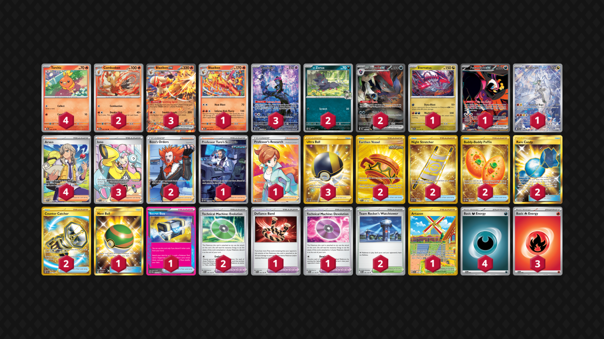

# Blaziken/Zoroark

Tier **3** | Difficulty: **Hard** | Gameplan: **Midrange Accumulate**

**Source**: Vince Amurao&Me - [Day 2 NAIC 2025, New Orleans](https://limitlesstcg.com/decks/list/18706)

## List
* 2 N's Zorua JTG 97
* 4 Torchic DRI 40
* 2 Combusken DRI 41
* 3 Blaziken ex JTG 24
* 1 Blaziken DRI 42
* 1 Eternatus SSP 141
* 3 Munkidori SFA 72
* 1 Fezandipiti ex SFA 92
* 2 N's Zoroark ex JTG 185
* 1 N's Reshiram JTG 167
* 4 Arven SVI 235
* 2 Earthen Vessel SFA 96
* 1 Defiance Band SVI 169
* 2 Night Stretcher SSP 251
* 1 Professor Turo's Scenario PAR 257
* 1 Nest Ball SUM 158
* 1 Technical Machine: Devolution PAR 177
* 3 Ultra Ball BRS 186
* 2 Boss's Orders LOR-TG 24
* 2 Technical Machine: Evolution PAR 178
* 1 Artazon OBF 229
* 2 Buddy-Buddy Poffin TWM 223
* 3 Iono PAL 254
* 2 Team Rocket's Watchtower DRI 180
* 1 Secret Box TWM 163
* 2 Rare Candy GRI 165
* 2 Counter Catcher PAR 264
* 1 Professor's Research PR-SW 152
* 4 Basic {D} Energy SVE 7
* 3 Basic {R} Energy SVE 2