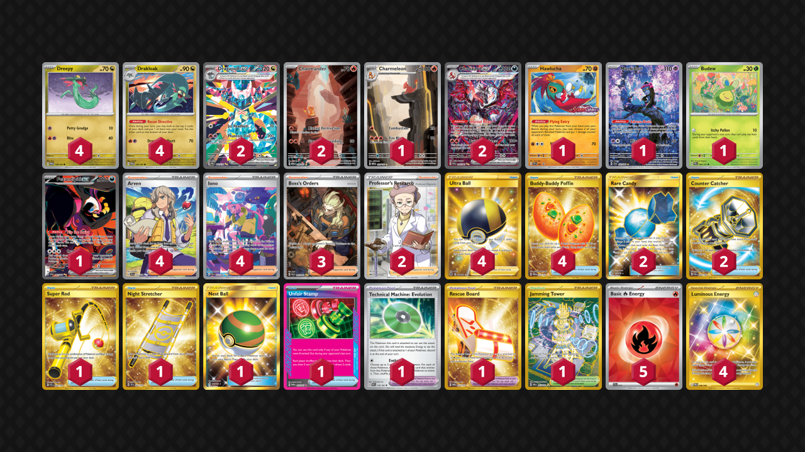

# Dragapult/Charizard

Tier **1** | Difficulty: **Hard** | Gameplan: **Accumulate**

**Source**: Ryan Antonucci - [Top 16 NAIC 2025, New Orleans](https://limitlesstcg.com/decks/list/18505)

## List
* 2 Dragapult ex PRE 165
* 2 Charizard ex PAF 234
* 4 Drakloak TWM 129
* 4 Dreepy TWM 128
* 1 Hawlucha PR-SV 7
* 1 Munkidori SFA 72
* 1 Budew PRE 4 PH
* 1 Charmeleon MEW 169
* 1 Fezandipiti ex SFA 92
* 2 Charmander MEW 168
* 4 Arven SVI 235
* 3 Boss's Orders PAL 265
* 1 Super Rod PAL 276
* 4 Iono PAF 237
* 1 Night Stretcher SSP 251
* 1 Nest Ball SUM 158
* 4 Ultra Ball BRS 186
* 1 Technical Machine: Evolution PAR 178
* 4 Buddy-Buddy Poffin TWM 223
* 1 Rescue Board TWM 225
* 2 Rare Candy GRI 165
* 2 Counter Catcher PAR 264
* 1 Unfair Stamp TWM 165
* 1 Jamming Tower DRI 243
* 2 Professor's Research SSH 201
* 5 Basic {R} Energy SVE 10
* 4 Luminous Energy TWM 226