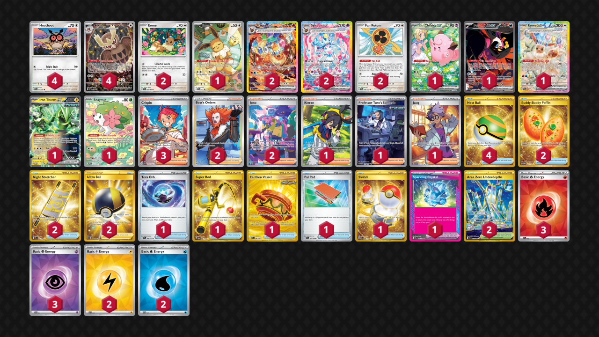

# Flareon/Sylveon

Tier **2** | Difficulty: **Extreme** | Gameplan: **Midrange Toolbox**

**Source**: Liam - [TrickyGym discord](nan)

## List
* 2 Flareon ex PRE 146
* 1 Lillie's Clefairy ex JTG 184
* 1 Fezandipiti ex SFA 92
* 1 Eevee ex PRE 167
* 4 Noctowl PR-SV 141
* 1 Iron Thorns ex TWM 77
* 2 Sylveon ex PRE 156
* 1 Eevee PR-SV 173
* 4 Hoothoot SCR 114
* 2 Fan Rotom SCR 118
* 1 Shaymin DRI 185
* 2 Eevee SFA 50
* 1 Kieran TWM 206
* 2 Buddy-Buddy Poffin TWM 223
* 3 Crispin SCR 164
* 1 Tera Orb SSP 189
* 1 Super Rod PAL 276
* 1 Professor Turo's Scenario PAR 257
* 2 Boss's Orders LOR-TG 24
* 4 Nest Ball SVI 255
* 1 Earthen Vessel SFA 96
* 1 Pal Pad SVI 182
* 2 Iono PAF 237
* 1 Switch MEW 206
* 2 Night Stretcher SSP 251
* 2 Area Zero Underdepths SCR 174
* 2 Ultra Ball BRS 186
* 1 Jacq SVI 236
* 1 Sparkling Crystal PRE 129
* 3 Basic {R} Energy SVE 10
* 2 Basic {L} Energy SVE 12
* 2 Basic {W} Energy SVE 11
* 3 Basic {P} Energy SVE 13