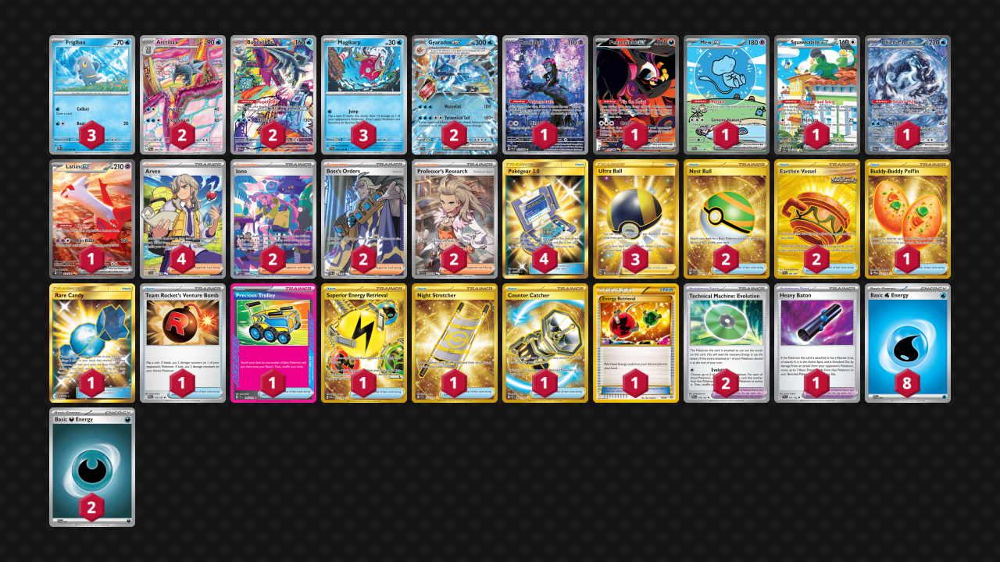

# Gyarados/Baxcalibur

Tier **F** | Difficulty: **Moderate** | Gameplan: **Midrange**

**Source**: nan - [TrickyGym discord](nan)

## List
* 1 Munkidori SFA 72
* 1 Fezandipiti ex SFA 92
* 2 Baxcalibur PAL 210
* 2 Gyarados ex SVI 45
* 1 Mew ex PAF 232
* 1 Squawkabilly ex PAL 264
* 1 Chien-Pao ex PAL 261
* 3 Frigibax PAF 17
* 3 Magikarp SVI 44
* 2 Arctibax PAL 209
* 1 Latias ex SSP 239
* 1 Buddy-Buddy Poffin TWM 223
* 1 Rare Candy GRI 165
* 1 Team Rocket's Venture Bomb DRI 179
* 1 Precious Trolley SSP 185
* 1 Superior Energy Retrieval PAL 277
* 2 Nest Ball SVI 255
* 2 Earthen Vessel SFA 96
* 1 Heavy Baton TEF 151
* 2 Iono PAF 237
* 4 Pokégear 3.0 UNB 233
* 1 Night Stretcher SSP 251
* 2 Boss's Orders PAL 248
* 2 Technical Machine: Evolution PAR 178
* 4 Arven SVI 235
* 3 Ultra Ball BRS 186
* 1 Counter Catcher PAR 264
* 2 Professor's Research SVI 240
* 1 Energy Retrieval AOR 99
* 2 Basic {D} Energy SVE 7
* 8 Basic {W} Energy SVE 3