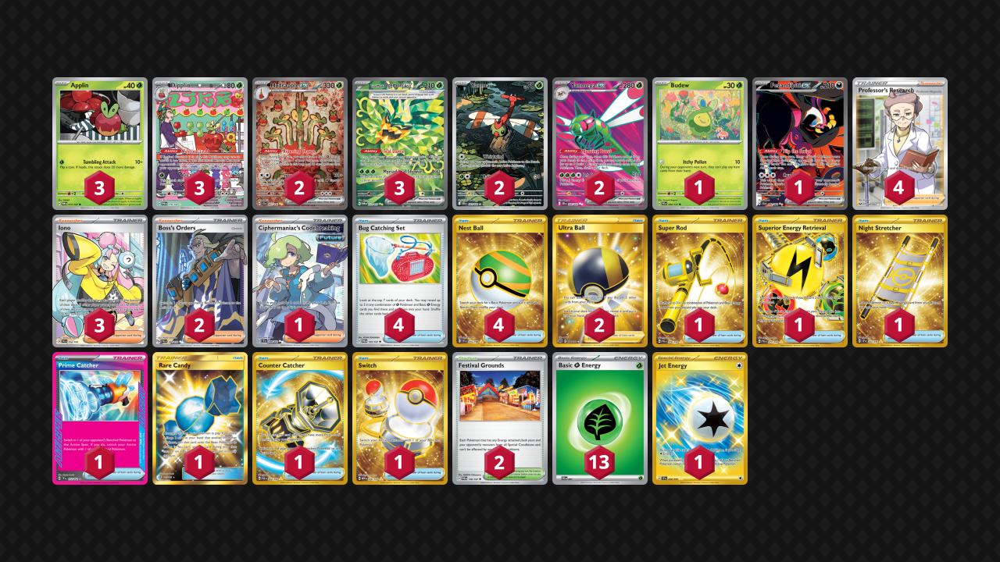

# Hydrapple/Yanmega

Tier **5** | Difficulty: **Moderate** | Gameplan: **Accumulate Midrange**

**Source**: バシラ - [Top 8 City League Kanagawa 03/22](https://limitlesstcg.com/decks/list/jp/34262)

## List
* 3 Teal Mask Ogerpon ex TWM 211
* 1 Budew PRE 4
* 2 Yanma DRI 183
* 2 Hydrapple ex SCR 167
* 1 Fezandipiti ex SFA 92
* 2 Yanmega ex DRI 206
* 3 Applin TWM 17
* 3 Dipplin TWM 170
* 1 Ciphermaniac's Codebreaking TEF 198
* 1 Super Rod PAL 276
* 1 Superior Energy Retrieval PAL 277
* 1 Night Stretcher SSP 251
* 2 Boss's Orders PAL 248
* 2 Ultra Ball BRS 186
* 1 Prime Catcher TEF 157
* 3 Iono PAL 254
* 1 Rare Candy GRI 165
* 1 Counter Catcher PAR 264
* 4 Bug Catching Set TWM 143
* 1 Switch MEW 206
* 2 Festival Grounds TWM 149
* 4 Professor's Research SSH 201
* 4 Nest Ball SVI 255
* 1 Jet Energy SSP 252
* 13 Basic {G} Energy SVE 1