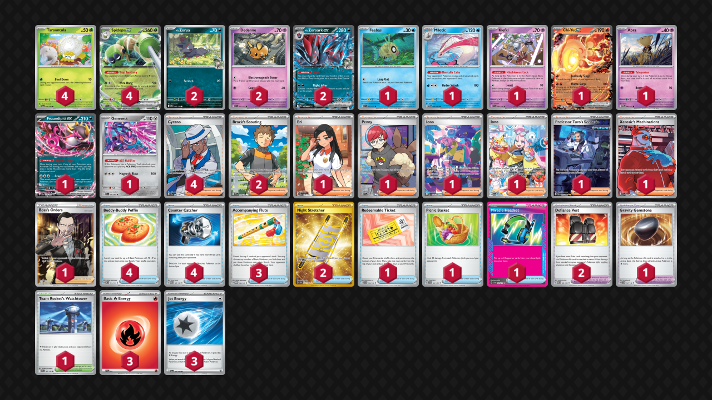

# Spidops/Dedenne

Tier **5** | Difficulty: **Hard** | Gameplan: **Control**

**Source**: Control Players Unite - [YouTube video](www.youtube.com/watch?v=xp6luhh10ag)

## List
* 2 N's Zorua JTG 97
* 4 Spidops ex SVI 19
* 1 Klefki SVI 96
* 1 Chi-Yu ex PAL 40
* 1 Milotic TWM 50
* 1 Abra TWM 80
* 2 Dedenne SSP 87
* 2 N's Zoroark ex JTG 98
* 1 Feebas SSP 41
* 4 Tarountula PAL 16
* 1 Fezandipiti ex SFA 38
* 1 Genesect SFA 40
* 4 Buddy-Buddy Poffin PRE 101
* 2 Brock's Scouting JTG 179
* 2 Defiance Vest PAR 162
* 4 Counter Catcher PAR 160
* 1 Eri PRE 136
* 1 Penny SVI 239
* 1 Iono PAF 237
* 1 Gravity Gemstone SCR 137
* 1 Iono PAL 269
* 2 Night Stretcher SSP 251
* 1 Professor Turo's Scenario PAR 257
* 4 Cyrano SSP 230
* 3 Accompanying Flute TWM 142
* 1 Redeemable Ticket JTG 156
* 1 Xerosic's Machinations SFA 89
* 1 Picnic Basket SVI 184
* 1 Team Rocket's Watchtower DRI 180
* 1 Miracle Headset SSP 183
* 1 Boss's Orders RCL 189
* 3 Basic {R} Energy SVE 2
* 3 Jet Energy PAL 190