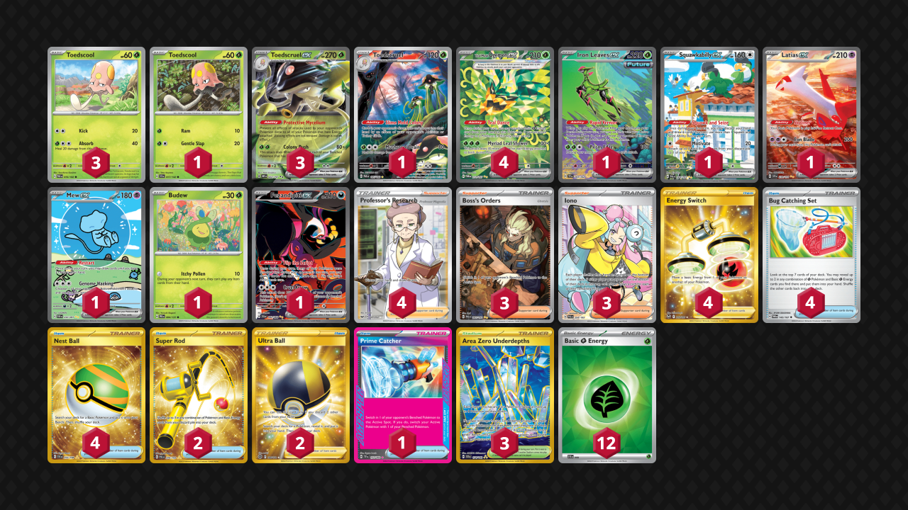

# Toedscruel/Ogerpon

Tier **2** | Difficulty: **Moderate** | Gameplan: **Aggro Turbo**

**Source**: Ray Chen - [Top 8 NAIC 2025, New Orleans](https://limitlesstcg.com/decks/list/18500)

## List
* 1 Iron Leaves ex TEF 203
* 1 Squawkabilly ex PAL 264
* 1 Toedscool SCR 17
* 4 Teal Mask Ogerpon ex TWM 211
* 1 Latias ex SSP 239
* 1 Mew ex PAF 232
* 1 Budew PRE 4 PH
* 3 Toedscruel ex OBF 22
* 3 Toedscool PAR 16
* 1 Fezandipiti ex SFA 92
* 1 Toedscruel PAR 185
* 3 Boss's Orders PAL 265
* 2 Super Rod PAL 276
* 2 Ultra Ball BRS 186
* 4 Energy Switch SIT 212
* 1 Prime Catcher TEF 157
* 3 Iono PAL 254
* 3 Area Zero Underdepths SCR 174
* 4 Bug Catching Set TWM 143
* 4 Professor's Research SSH 201
* 4 Nest Ball SVI 255
* 12 Basic {G} Energy SVE 9