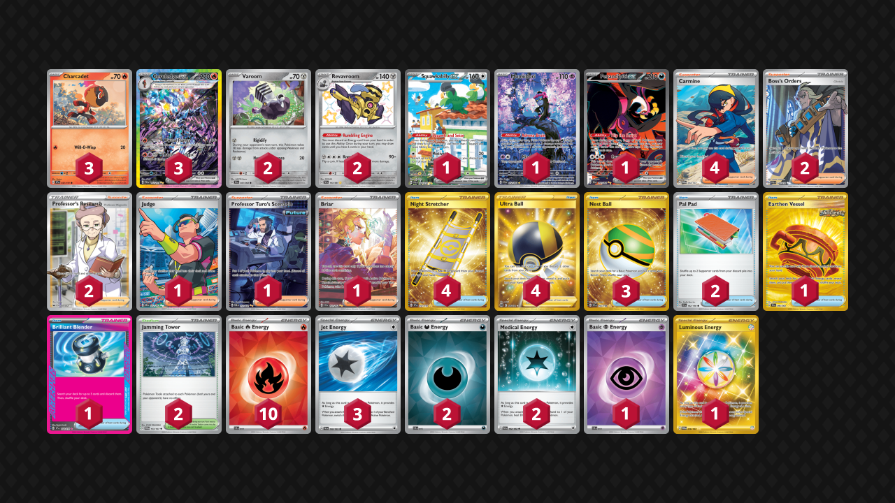

# Ceruledge/Revavroom

Tier **3** | Difficulty: **Moderate** | Gameplan: **Midrange Accumulate**

**Source**: Michael Huynh - [1st Place Card Temple Weekly Battles #24](https://play.limitlesstcg.com/tournament/6887817d251cd5b162f01f90/player/nothieu/decklist)

## List
* 2 Varoom SFA 43
* 2 Revavroom PAF 193
* 1 Squawkabilly ex PAL 264
* 1 Munkidori SFA 72
* 3 Ceruledge ex PRE 147
* 1 Fezandipiti ex SFA 92
* 3 Charcadet SSP 32
* 1 Earthen Vessel SFA 96
* 1 Brilliant Blender SSP 164
* 2 Jamming Tower TWM 153
* 1 Judge DRI 222
* 4 Night Stretcher SSP 251
* 1 Professor Turo's Scenario PAR 257
* 2 Boss's Orders PAL 248
* 4 Ultra Ball BRS 186
* 2 Pal Pad SVI 182
* 1 Briar SCR 171
* 4 Carmine TWM 204
* 2 Professor's Research SSH 201
* 3 Nest Ball SVI 255
* 2 Basic {D} Energy SVE 15
* 10 Basic {R} Energy SVE 10
* 1 Basic {P} Energy SVE 13
* 1 Luminous Energy TWM 226
* 3 Jet Energy PAL 190
* 2 Medical Energy PAR 182