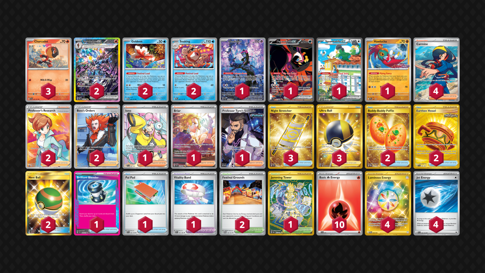

# Ceruledge/Seaking

Tier **5** | Difficulty: **Moderate** | Gameplan: **Midrange Accumulate**

**Source**: Red W - [TOURNAMENT OF DOOM! Best Starter Edition](TOURNAMENT OF DOOM! Best Starter Edition)

## List
* 2 Ceruledge ex PRE 147
* 1 Munkidori SFA 72
* 1 Fezandipiti ex SFA 92
* 3 Charcadet SSP 32
* 1 Squawkabilly ex PAL 264
* 1 Hawlucha PR-SV 7
* 2 Goldeen TWM 44
* 2 Seaking PRE 21
* 4 Carmine TWM 204
* 2 Buddy-Buddy Poffin TWM 223
* 2 Professor's Research PR-SW 152
* 1 Iono PAL 254
* 2 Festival Grounds TWM 149
* 1 Jamming Tower DRI 243
* 2 Boss's Orders LOR-TG 24
* 2 Earthen Vessel SFA 96
* 1 Brilliant Blender SSP 164
* 1 Pal Pad SVI 182
* 3 Night Stretcher SSP 251
* 2 Nest Ball SUM 158
* 1 Briar SCR 171
* 1 Professor Turo's Scenario PAR 240
* 3 Ultra Ball BRS 186
* 1 Vitality Band SVI 197
* 4 Luminous Energy TWM 226
* 4 Jet Energy PAL 190
* 10 Basic {R} Energy SVE 18