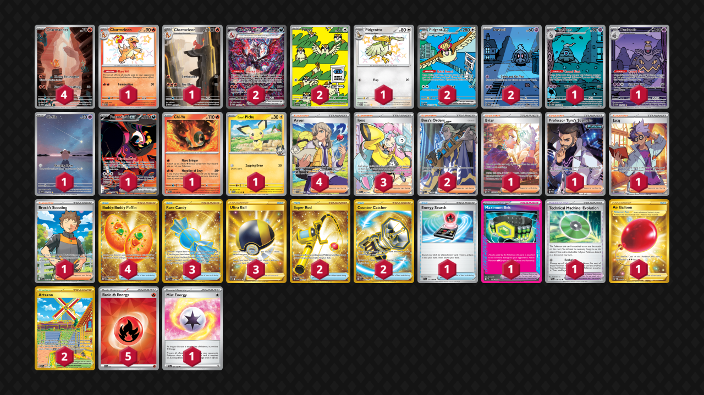

# Charizard/Dusknoir

Tier **2** | Difficulty: **Hard** | Gameplan: **Accumulate**

**Source**: Matt Bacnis - [Top 16 World Championships 2025](https://limitlesstcg.com/decks/list/18927)

## List
* 2 Pidgey OBF 207
* 1 Charmeleon PAF 110
* 1 Cleffa OBF 202
* 2 Pidgeot ex OBF 225
* 1 Fezandipiti ex SFA 92
* 1 Charmeleon MEW 169
* 4 Charmander MEW 168
* 1 Chi-Yu PAR 29
* 2 Duskull SFA 68
* 1 Pidgeotto PAF 197
* 2 Charizard ex PAF 234
* 1 Dusclops SFA 69
* 1 Ethan's Pichu DRI 71
* 1 Dusknoir SFA 70
* 4 Buddy-Buddy Poffin TWM 223
* 3 Iono PAL 254
* 2 Super Rod PAL 276
* 2 Artazon OBF 229
* 1 Energy Search SVI 172
* 3 Rare Candy SVI 256
* 1 Maximum Belt TEF 154
* 2 Boss's Orders PAL 248
* 1 Briar SCR 171
* 1 Technical Machine: Evolution PAR 178
* 1 Professor Turo's Scenario PAR 240
* 4 Arven SVI 235
* 3 Ultra Ball BRS 186
* 1 Jacq SVI 236
* 2 Counter Catcher PAR 264
* 1 Brock's Scouting JTG 179
* 1 Air Balloon SSH 213
* 5 Basic {R} Energy SVE 10
* 1 Mist Energy TEF 161