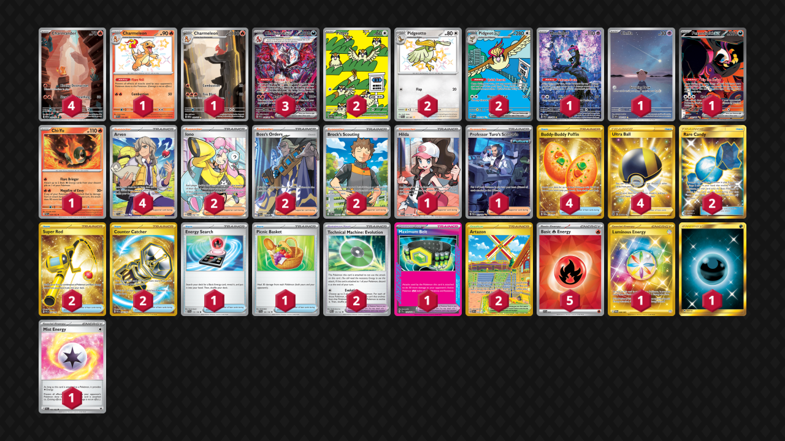

# Charizard/Pidgeot

Tier **2** | Difficulty: **Hard** | Gameplan: **Accumulate**

**Source**: Illusion | Vicente - [1st Place Pumpka Weekly](https://play.limitlesstcg.com/tournament/687d378c3e7086bfd3b9b106/player/vicentenun/decklist)

## List
* 1 Munkidori SFA 72
* 2 Pidgey OBF 207
* 1 Charmeleon PAF 110
* 1 Cleffa OBF 202
* 2 Pidgeot ex OBF 225
* 1 Fezandipiti ex SFA 92
* 1 Charmeleon MEW 169
* 4 Charmander MEW 168
* 1 Chi-Yu PAR 29
* 2 Pidgeotto PAF 197
* 3 Charizard ex PAF 234
* 4 Buddy-Buddy Poffin TWM 223
* 2 Iono PAL 254
* 2 Rare Candy GRI 165
* 1 Hilda WHT 164
* 2 Super Rod PAL 276
* 2 Artazon OBF 229
* 1 Professor Turo's Scenario PAR 257
* 1 Energy Search SVI 172
* 1 Maximum Belt TEF 154
* 1 Picnic Basket SVI 184
* 2 Boss's Orders PAL 248
* 2 Technical Machine: Evolution PAR 178
* 4 Arven SVI 235
* 4 Ultra Ball BRS 186
* 2 Counter Catcher PAR 264
* 2 Brock's Scouting JTG 179
* 1 Luminous Energy TWM 226
* 5 Basic {R} Energy SVE 10
* 1 Basic {D} Energy BUS 168
* 1 Mist Energy TEF 161