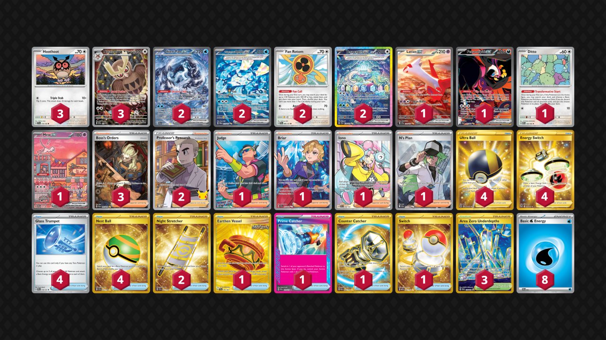

# Chien-Pao/Noctowl

Tier **Undefined** | Difficulty: **Undefined** | Gameplan: **Midrange Breaker**

**Source**: Thomas Dewsbury - [Twitter post](https://x.com/d3wzy/status/1958270531095896157)

## List
* 2 Chien-Pao ex PAL 261
* 2 Wellspring Mask Ogerpon ex TWM 213
* 1 Latias ex SSP 239
* 2 Fan Rotom PRE 85
* 3 Hoothoot SCR 114
* 1 Fezandipiti ex SFA 92
* 1 Ditto MEW 132
* 2 Terapagos ex SCR 170
* 1 Mew ex PR-SV 53
* 3 Noctowl PR-SV 141
* 1 Earthen Vessel SFA 96
* 3 Boss's Orders PAL 265
* 1 Judge DRI 222
* 2 Night Stretcher SSP 251
* 4 Ultra Ball BRS 186
* 1 Prime Catcher PRE 119
* 2 Professor's Research CEL 24
* 4 Energy Switch SIT 212
* 1 Briar SCR 163
* 4 Glass Trumpet PRE 110
* 1 Iono PAL 254
* 3 Area Zero Underdepths SCR 174
* 1 N's Plan BLK 163
* 1 Counter Catcher PAR 264
* 1 Switch MEW 206
* 4 Nest Ball SVI 255
* 8 Basic {W} Energy SVE 3